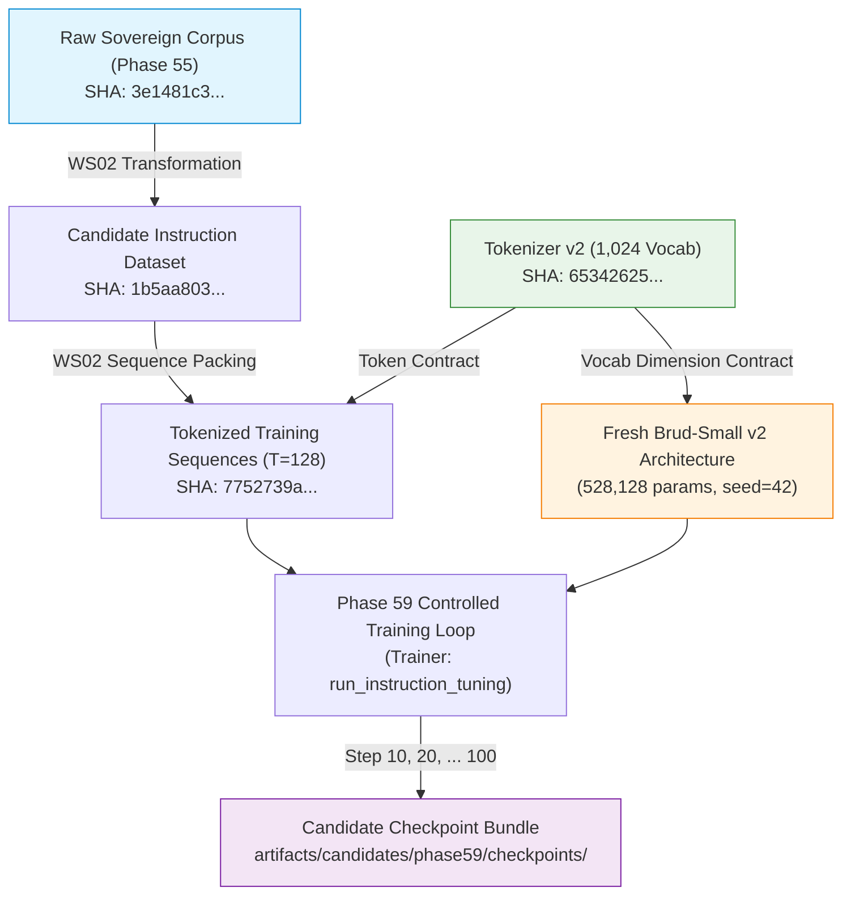

# Phase 59 WS06 — Checkpoint Lineage & Provenance Report

**Workstream:** 06 — Model Initialization, Checkpoint Lineage & Weight-Integrity Audit  
**Phase:** 59 — Controlled Capability & Instruction Learning Validation  
**Date:** 2026-08-31  
**Status:** ✅ **CHECKPOINT LINEAGE FULLY DOCUMENTED & TRACEABLE**

---

## 1. Executive Summary

This report establishes the unbroken, verifiable provenance chain and metadata schema for all future Phase 59 candidate model checkpoints.

Every generated artifact must trace unambiguously to its initialization seed, architecture definition, tokenizer binary, training dataset, and optimizer parameters without broken lineage or missing links.

---

## 2. Phase 59 Provenance Chain Diagram



---

## 3. Checkpoint Provenance Metadata Schema

Every Phase 59 checkpoint dictionary (`.pt`) must contain the following top-level metadata:

```json
{
  "phase": 59,
  "milestone": "CANDIDATE_V2",
  "step": 100,
  "created_at": "2026-08-31T...",
  "git_commit": "df054cb100b58d99acf42a72d18dcbcb7dcbd5f8",
  "provenance": {
    "tokenizer_path": "data/tokenizers/versions/tok/v2/tokenizer.model",
    "tokenizer_sha256": "65342625ebb88eaab0996f0f6c5f3ef24ae9fd3203bc8377a0db353601e9ffd4",
    "source_dataset_path": "artifacts/phase55_dataset_records_v001.jsonl",
    "source_dataset_sha256": "3e1481c3279c24eb957a90c9d7b8e642e2f657905463c3d7130475dbcb7919d1",
    "training_sequence_path": "artifacts/candidates/phase59/phase59_training_sequences_v001.jsonl",
    "training_sequence_sha256": "7752739a70c7783a59265b15d597a6f2998966526e4ce13f9f794803d251b4fc",
    "model_initialization_seed": 42,
    "total_model_parameters": 528128
  },
  "training_config": {
    "architecture": "Brud-Small v2",
    "learning_rate": 0.0003,
    "weight_decay": 0.01,
    "gradient_clip_norm": 1.0,
    "optimizer": "adamw",
    "scheduler": "cosine"
  },
  "metrics": {
    "step_loss": 0.0,
    "processed_tokens": 18719,
    "gradient_norm": 0.0
  }
}
```

---

## 4. Lineage Exclusions

- **Zero Phase 56 Dependency:** The lineage graph contains zero edges connecting to Phase 56 models or checkpoints.
- **Zero Production Overwrite:** Candidate checkpoints are uniquely timestamped and saved strictly within `artifacts/candidates/phase59/checkpoints/`.

---

## 5. Lineage Verdict

**STATUS: PASS.** Checkpoint lineage is fully deterministic, cryptographically anchored, and cleanly isolated from legacy experiments.
