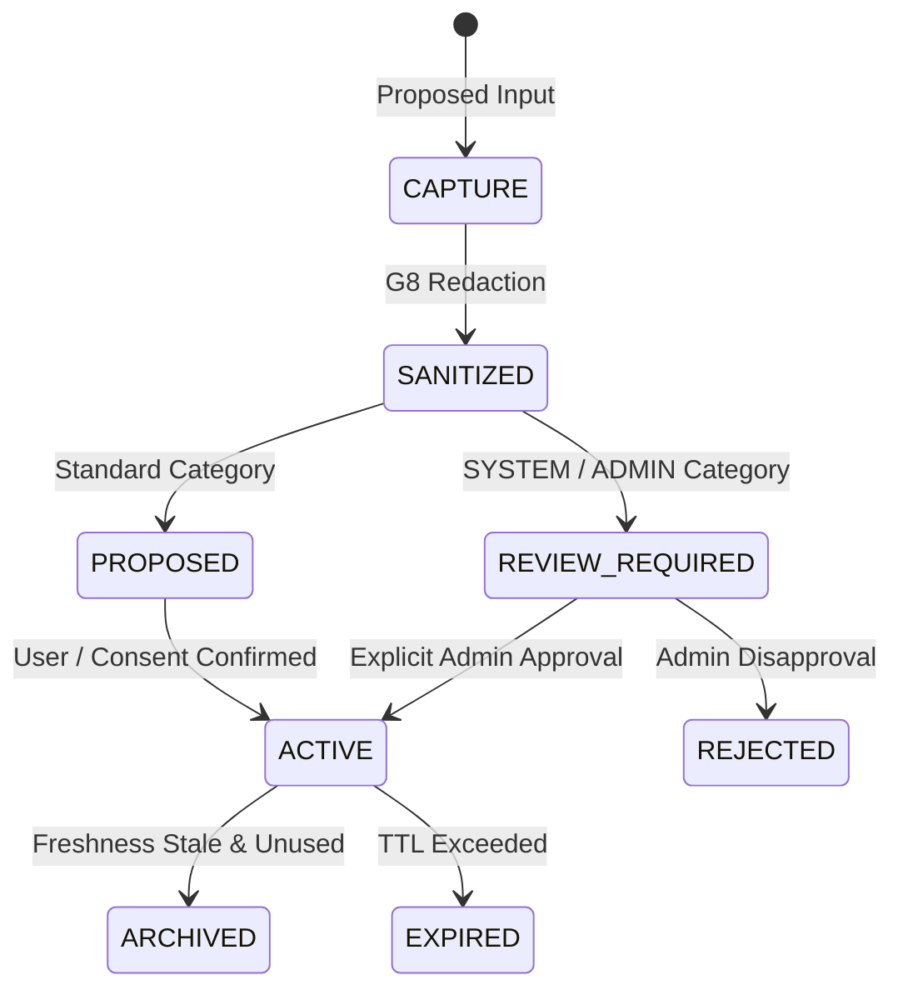

# P17.3 Memory Governance Report

**Target Scope**: System & Admin Memory Governance  
**Date**: 2026-09-06  

---

## 1. Governance Axiom

> **Memory Intelligence $\neq$ Memory Governance $\neq$ Authorization**

A memory item may have:
- `importance_score = 100.0`
- `confidence_score = 100.0`
- `evidence_count = 50`

However, if its category is **`SYSTEM`** or **`ADMIN`**, it **CANNOT** become `ACTIVE` or authoritative without explicit human administrative approval.

---

## 2. Governance State Machine

---

## 3. Verification

- Unapproved `SYSTEM`/`ADMIN` memories remain in `REVIEW_REQUIRED` state.
- Retrieval filters strictly exclude unapproved `SYSTEM`/`ADMIN` memories from downstream LLM prompt context.
