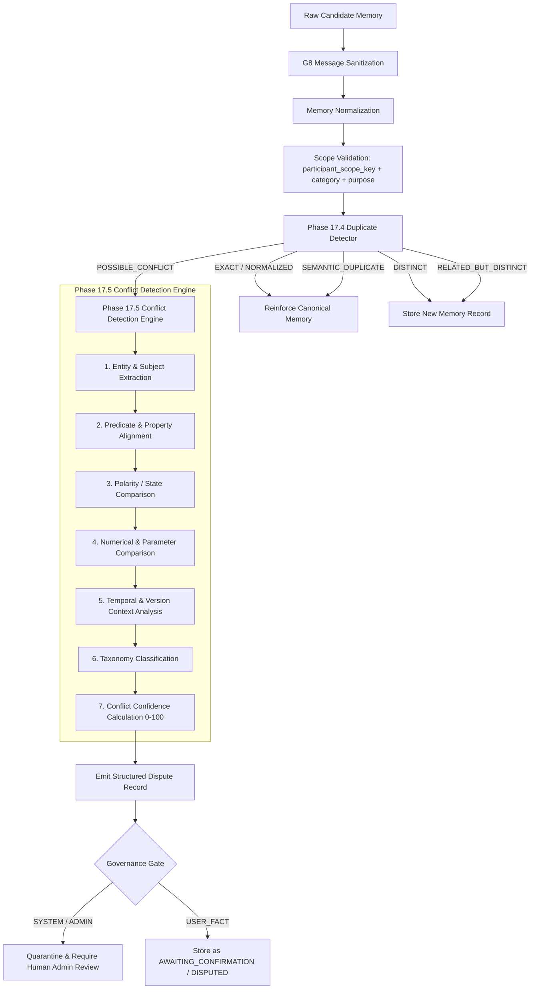

# Phase 17.5 Stage A: Conflict Architecture & Detection Engine Design

**Date**: 2026-09-06  
**Status**: ARCHITECTURE SPECIFICATION ONLY (Zero Production Code Changes)  
**Target Module**: `core_model/mini_brain/intelligence/conflict_detector.py`

---

## 1. Architectural Pipeline

Conflict detection sits directly downstream of the Duplicate Knowledge Engine (Phase 17.4) and executes whenever semantic similarity is detected ($\ge 0.65$) but exact/normalized matching did not resolve the candidate:



---

## 2. Core Domain Components to Introduce in Stage B

### 2.1 `ConflictType` (Taxonomy Enum)
Categorizes the exact semantic nature of the contradiction:
- `VALUE_CONFLICT`: Incompatible qualitative value for identical entity attribute (e.g., `"model provider is Anthropic"` vs `"model provider is OpenAI"`).
- `NUMERIC_CONFLICT`: Contradictory quantitative metrics, counts, or thresholds (e.g., `"token limit is 2048"` vs `"token limit is 4096"`).
- `STATE_CONFLICT`: Mutually exclusive boolean/operational states (e.g., `"maintenance mode is enabled"` vs `"maintenance mode is disabled"`).
- `TEMPORAL_CONFLICT`: Incompatible schedules, intervals, or frequencies (e.g., `"backup runs every 24 hours"` vs `"backup runs every 12 hours"`).
- `POLICY_CONFLICT`: Incompatible administrative operational constraints (e.g., `"retention requires manual approval"` vs `"retention is automatic"`).
- `VERSION_CONFLICT`: Competing claims originating from differing system versions (e.g., `"v1 API uses port 8000"` vs `"v2 API uses port 8443"`).

### 2.2 `ConflictConfidenceScore` (0–100)
A deterministic multi-factor score evaluating how certain the engine is that a genuine factual contradiction exists:
$$\text{ConflictConfidence} = w_e \cdot S_{\text{entity}} + w_p \cdot S_{\text{predicate}} + w_v \cdot S_{\text{value\_incompat}} + w_{\text{pol}} \cdot S_{\text{polarity}}$$

Where:
- $S_{\text{entity}}$ (Subject/Entity Match): 1.0 if subjects match identically.
- $S_{\text{predicate}}$ (Predicate Match): 1.0 if property/attribute matched.
- $S_{\text{value\_incompat}}$ (Value Contradiction): 1.0 if numeric/temporal/parameter values are strictly mutually exclusive.
- $S_{\text{polarity}}$ (Polarity Inversion): 1.0 if affirmative vs negation detected.

### 2.3 `DisputeRecord` (Structured Representation)
An immutable structured entity encapsulating the conflict context:
```python
@dataclass(frozen=True)
class DisputeRecord:
    dispute_id: str
    participant_scope_key: str
    conflict_type: ConflictType
    conflict_confidence: float  # 0.0 - 100.0
    existing_memory_public_id: str
    existing_display_value: str
    existing_provenance: dict[str, Any]
    candidate_display_value: str
    candidate_provenance: dict[str, Any]
    conflict_reason: str
    lifecycle_state: str  # DETECTED, PENDING_REVIEW, UNDER_REVIEW, RESOLVED, DISMISSED
    created_at: str
    resolution_metadata: dict[str, Any] | None = None
```

---

## 3. Interaction with Memory Persistence & Events

1. **Zero Destructive Mutation**: Neither the existing memory nor the candidate memory is destroyed, overwritten, or truncated upon conflict detection.
2. **Event Ledger Logging**: The detection of a dispute emits an immutable `memory_item_events` entry:
   - `event_type`: `"CONFLICT_DETECTED"`
   - `details_json`: Sanitized metadata including `conflict_type`, `conflict_confidence`, `conflicting_memory_public_id`, and reason.
3. **Retrieval Protection**: Both records remain linked in the conflict graph so retrieval queries can penalize, filter, or decorate disputed facts with conflict warnings.
