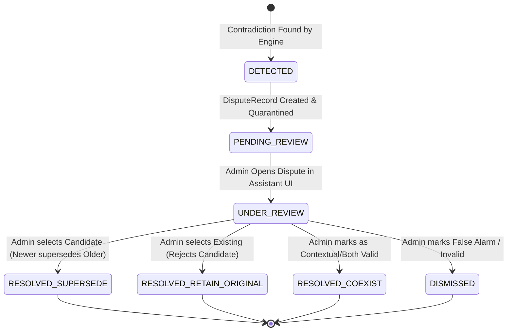

# Phase 17.5 Stage A: Resolution Governance & Lifecycle Report

**Date**: 2026-09-06  
**Status**: DESIGN & GOVERNANCE SPECIFICATION (Zero Production Changes)  
**Guardrail Focus**: G1 (Zero Autonomous Execution), G5 (Scope Isolation), G8 (Zero Secret Leakage)

---

## 1. Governance Boundary & Human Arbitration

In accordance with architectural guardrail **G1 (Advisory-Only Governance)**:
- **AI Role**: Detect, classify, summarize, score confidence, and propose candidate resolution options.
- **AI Restriction**: The AI must **NEVER** silently resolve disputes or mutate authoritative knowledge autonomously.
- **Human Authority**: Only authenticated administrators or explicit user confirmation can finalize a dispute resolution.

```
+-----------------------------------------------------------------------------------+
|                            GOVERNANCE BOUNDARY                                    |
|                                                                                   |
|   +------------------------------------+    +---------------------------------+   |
|   |         AI RUNTIME (ADVISORY)      |    |    ADMINISTRATOR / USER (AUTH)  |   |
|   | - Detects Contradiction            |    | - Reviews Competing Claims      |   |
|   | - Calculates Conflict Confidence   | -> | - Evaluates Source Provenance   |   |
|   | - Preserves Both Records           |    | - Selects Resolution Strategy   |   |
|   | - Proposes Resolution Recommendation|   | - Formally Authorizes Update   |   |
|   +------------------------------------+    +---------------------------------+   |
+-----------------------------------------------------------------------------------+
```

---

## 2. Dispute Lifecycle State Machine

A structured 5-state lifecycle governs every identified conflict:



### State Definitions
1. **`DETECTED`**: Contradiction identified by `ConflictDetectionEngine` during memory proposition.
2. **`PENDING_REVIEW`**: Immutable `DisputeRecord` recorded in ledger; conflicting memories marked with `conflict_status = "conflict_requires_confirmation"`.
3. **`UNDER_REVIEW`**: Admin or user is actively inspecting the dispute via the Admin Assistant UI.
4. **`RESOLVED`**: Authorized human decision applied:
   - `SUPERSEDE_EXISTING`: Existing memory version transitioned to `superseded`; candidate promoted to `active`.
   - `RETAIN_EXISTING`: Existing memory remains `active`; candidate transitioned to `rejected`.
   - `RETAIN_BOTH_COEXIST`: Both memories marked `active` with differentiated contextual/version tags.
5. **`DISMISSED`**: Marked as a false positive without changing memory status.

---

## 3. Resolution Outcomes & Rollback Safety

Every resolution action must generate an immutable audit log and memory event:
1. **Audit Event Details**: Recorded in `audit_logs` with `action = "memory_conflict_resolved"`, `actor = admin_id`, `dispute_id`, `resolution_type`, and `reason`.
2. **Rollback Safety**: Because all versions are stored immutably in `memory_item_versions`, any supersession can be instantly rolled back to the previous version without data loss.
3. **No Silent Truth Imposition**: The system never deletes history; superseded records retain their provenance, evidence count, and original timestamps for full auditability.
