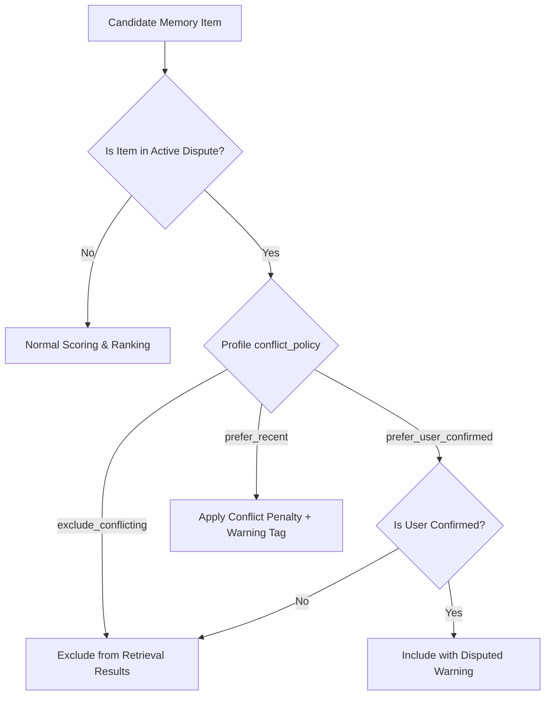

# Phase 17.5 Stage A: Memory Retrieval Under Conflict Report

**Date**: 2026-09-06  
**Status**: ARCHITECTURAL SPECIFICATION ONLY (Zero Production Code Changes)  
**Subject**: Retrieval Behavior, Context Assembly, and Conflict Policy Handling

---

## 1. The Core Principle: Never Assert Disputed Claims as Undisputed Truth

When an active memory item is subject to an unresolved dispute (`PENDING_REVIEW` or `conflict_status = "conflict_requires_confirmation"`):
- The retrieval engine must **NEVER** silently inject the disputed claim into the LLM context as an absolute ground truth.
- Doing so violates **G9 (Truthful Grounding)**.

---

## 2. Retrieval Strategies & Conflict Policies

`memory_retrieval_profiles` already includes a `conflict_policy` column with 3 options:
1. `prefer_recent`
2. `prefer_user_confirmed`
3. `exclude_conflicting`

### Recommended Phase 17.5 Implementation of Policies



### Strategy Breakdown

1. **`exclude_conflicting` (Safest / Default for High-Security Tasks)**:
   - Disputed memory items are immediately excluded during `candidate_is_retrievable()` access filtering.
   - Exclusion reason logged: `"disputed_memory_pending_resolution"`.
2. **`prefer_user_confirmed`**:
   - If Memory A is `user_confirmed` and Memory B is `assistant_inferred`, Memory A is included with a `[DISPUTED_WARNING]` tag, while Memory B is excluded.
   - If both are `user_confirmed` or both unconfirmed, both are excluded until human arbitration.
3. **`prefer_recent` (Advisory Mode Only)**:
   - The more recent memory is retrieved but penalized by `weights.conflict_penalty = 0.3` in `compute_combined_score`.
   - Context decorator prepends: `[Note: Disputed fact — subject to review]`.

---

## 3. Context Injection & Grounding Format

When a disputed memory is retrieved under an advisory profile, it is formatted to make the ambiguity transparent:
```
[MEMORY CONTEXT]
- (ID: mem-01a) Backup schedule: 24 hours [STATUS: ACTIVE]
- (ID: mem-02b) Backup schedule: 12 hours [STATUS: DISPUTED - UNDER REVIEW]
[END MEMORY CONTEXT]
```

This prevents the LLM from hallucinating certainty and empowers the model to acknowledge uncertainty honestly to the user.
