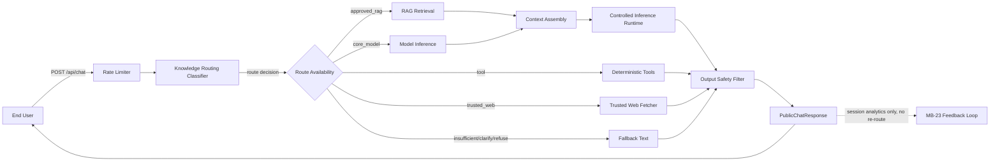
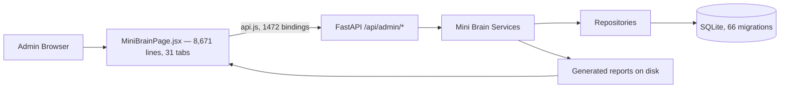
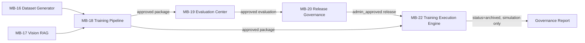
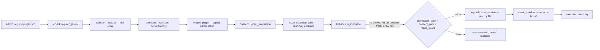

# Brud AI — Master Audit & Full System Verification Report

**Audit date:** 2026-08-08
**Scope:** Full repository — architecture, database, API, frontend, security, privacy, performance, test coverage, deployment readiness, and 14 end-to-end workflows.
**Governing rule applied throughout:** nothing is reported as correct because a previous phase report said so — every claim below is backed by a command actually run or a file actually read during this audit, with file:line citations wherever possible. Where something could not be verified, that limitation is stated plainly rather than glossed over.

---

## Table of Contents

1. [Executive Summary](#1-executive-summary)
2. [Full Technical Audit Report](#2-full-technical-audit-report)
3. [Security Findings Report](#3-security-findings-report)
4. [Database Schema Report](#4-database-schema-report)
5. [API Inventory](#5-api-inventory)
6. [Frontend Inventory](#6-frontend-inventory)
7. [Test & Regression Report](#7-test--regression-report)
8. [Deployment Checklist](#8-deployment-checklist)
9. [User Capability Guide](#9-user-capability-guide)
10. [Admin Capability Guide](#10-admin-capability-guide)
11. [Top 20 Fixes](#11-top-20-fixes)
12. [Production Readiness Verdict](#12-production-readiness-verdict)

---

## 1. Executive Summary

Brud AI is a large, genuinely-functioning local-first AI assistant platform: a public chat surface backed by RAG retrieval and a CPU-run local model, wrapped in an unusually deep admin governance stack (the "Mini Brain" phases, MB-16 through MB-25) covering dataset curation, training-package assembly, evaluation, release governance, an external-AI comparison gateway, a self-improvement feedback loop, and — the most safety-critical new work — a full plugin governance and execution runtime with real risk-scoring, staged admin review, and cooperative sandboxing.

**What this audit found, in one paragraph:** the codebase is disciplined and consistently engineered — a strict pure-function/impure-orchestration split, aggressive reuse of shared primitives (hashing, sanitization, confined-path resolution) across every phase, zero SQL injection/XSS/CSRF/CORS findings, genuinely local-first data handling with two narrow and explicitly consent-gated exceptions, and a plugin governance chain that structurally forbids auto-enable/auto-approve at every step. Against that strength sit a small number of real, concrete problems: two currently-failing tests caused by a genuinely un-registered API router and an un-registered dashboard nav key (both one-line fixes), one admin-gated but under-constrained subprocess code path, zero per-tab loading indicators across an 8,671-line single-file admin dashboard component, no Dockerfile anywhere in the repository, and a test-suite environment fragility (tmpfs exhaustion under batched runs) that this audit itself hit, diagnosed, and confirmed does **not** correspond to real code defects — a false alarm the audit is reporting explicitly as a false alarm rather than passing along unverified.

**Top strengths (verified, not asserted):**
- **Security:** no Critical or High findings across 12 categories reviewed; the one real Medium finding is admin-gated, not public-facing.
- **Privacy/local-first:** the claim "user data remains on the user's machine unless explicitly consented" holds up under source-level verification — zero frontend telemetry, local SQLite storage, and every external-network code path is off-by-default and consent- or admin-review-gated.
- **Admin governance depth:** MB-16 through MB-25 form a genuinely real, human-in-the-loop pipeline where no later phase can silently auto-approve or auto-execute an earlier phase's output — verified structurally via AST-based safety tests, not just claimed in documentation.
- **Database integrity:** 483 tables, zero name collisions, clean migration ordering v1→v66, a real fresh-database migration run succeeded.

**Top risks (verified, not asserted):**
- **Reliability gaps:** 2 known + 1 newly-discovered real test failures, both root-caused to simple registration omissions, not deep bugs — but currently failing regardless.
- **Maintainability concentration:** two very large single files (`backend/database/schema.py` at 13,471 lines, `apps/admin-dashboard/src/pages/MiniBrainPage.jsx` at 8,671 lines) are correctness-safe today but an increasing navigation/collision cost.
- **Production readiness:** no containerization, no documented reverse-proxy/TLS setup, a real ~19-second cold start dominated by ML library imports, and a single-writer SQLite concurrency ceiling appropriate for the project's own local-first/single-operator design point but not for multi-tenant SaaS load.
- **Unverified claims to stop making until tested:** live Tamil-language conversational quality, and whether plugin execution (MB-24/25) is actually reachable from an ordinary public chat message rather than only via direct API call with a pre-issued token.

**Maturity level: Beta**, trending toward Release Candidate once the handful of Critical/High items in the [Action Plan](#final-action-plan) are closed. See [Section 12](#12-production-readiness-verdict) for the full scorecard and verdict.

---

## 2. Full Technical Audit Report

### 2.1 Repository Inventory

**8,334 total files** (excluding venv/git/pycache), **1,259 git-tracked** (12.68 MiB pack size), **2.3G total repository size**: `venv/` 1.4G, `data/` 721M, `apps/` 188M, `tests/` 16M, `backend/` 16M, `core_model/` 7.1M, `docs/` 2.4M, `config/` 108K.

**File-extension counts:** pdf 4,815, py 1,425, png 630, jsonl 515, json 355, md 293, jsx 82, db 28, js 23. `backend/database/schema.py` (725,545 bytes) is the largest tracked source file.

**Cleanup candidates flagged:**
| Path | Size | Status |
|---|---|---|
| `data/brud_ai.db` | 0 bytes | Stale/empty artifact, untracked, coexists confusingly alongside the real dev database at `data/database/brud_ai.db` (8.5MB, live, WAL mode, 407 tables) — a real "which file is the database" trap for a new operator. |
| `data/manual_verification_phase20/` | 16M | Untracked cleanup candidate |
| `data/manual_verification_phase20_clean/` | 16M | Untracked cleanup candidate |
| `data/manual_verification_phase21a/` | 69M | Untracked cleanup candidate |

### 2.2 Architecture Review

| Subsystem | Purpose | Depends On | Status |
|---|---|---|---|
| Public Chat Router | Rate-limited public `/api/chat` entrypoint: classify → route → answer | Knowledge classifier, RAG, memory, inference, tools, trusted web | ✅ Implemented |
| Chat Orchestration | Assembles bounded context, calls inference runtime | Inference runtime, RAG, memory | ✅ Implemented |
| RAG Retrieval | Retrieval over approved, indexed documents | Document processing, embeddings | ✅ Implemented |
| Vision Intelligence (MB-15/16) | Image extraction, OCR cross-validation, captioning | Document service, OCR | ✅ Implemented |
| Deterministic Tools | Fixed 3-tool catalogue (calculator, unit conversion, date/time) | None external | ✅ Implemented (intentionally small) |
| Admin Assistant | In-dashboard assistant invoking registered admin actions | `action_registry.py`, `dashboard_registry.py` | ✅ Implemented |
| MB-16–19 Dataset/Training/Evaluation | Multimodal dataset → training package → benchmark evaluation | Vision, RAG, tokenizer | ✅ Implemented |
| MB-20 Release Governance | Safety/compliance/benchmark gates before "approved" | MB-16–19 | ✅ Implemented (never deploys) |
| MB-21 External AI Gateway | Admin-authorized sanitized dispatch to external LLM providers | Prompt sanitizer, provider registry | ✅ Implemented, `is_available()` honestly `False` (no key configured) |
| MB-22 Training Execution Engine | Governance-gated training job lifecycle | MB-18, MB-20 | ⚠️ Real for simulation mode only — real backends disclosed stubs |
| MB-23 Public Chat Runtime & Feedback Loop | Session analytics, gap detection, advisory improvement candidates | Public Chat Router | ✅ Implemented |
| MB-24 Plugin Governance | Deterministic permission/consent/risk/sandbox-policy engine | Self-contained | ✅ Implemented (governance metadata only) |
| MB-25 Plugin Execution Runtime | Actually runs an admin-approved on-disk `.py` plugin | MB-24 | ✅ Implemented; explicitly **no container/process isolation** |
| Admin Dashboard | Single-page React app, every phase's admin console | `api.js` → all backend routes | ✅ Implemented, concentrated in one 8,671-line component |

**Architecture Map 1 — Public Chat flow**

**Status: ✅ fully implemented**, verified via `test_public_chat_routing_service.py`'s genuine (no-mock) model-generation and RAG-retrieval tests. Note: this flow's routing decision tree does **not** include a plugin-execution branch — see the Phase 3/User Capability Guide finding on plugin-in-chat wiring.

**Architecture Map 2 — Admin Dashboard flow**

**Status: ✅ implemented**, architecturally centralized (see §2.9 Code Quality and Top 20 Fixes #6/#9).

**Architecture Map 3 — Training → Evaluation → Release → Training Engine**

**Status: ✅ implemented end-to-end for simulation mode**; ⚠️ real GPU/CPU training is an honestly-disclosed stub — `BackendUnavailableError` is raised by design, so no job can ever silently claim to have trained a real model.

**Architecture Map 4 — Plugin Governance → Plugin Runtime → Execution**

**Status: ✅ implemented, the most safety-critical subsystem in the project.** MB-25 never trusts a cached MB-24 decision. **Explicit, disclosed limitation: no container or process isolation.**

**Architecture Map 5 — External AI Gateway → Evaluation → Improvement Candidate → Admin Review**

**Status: ✅ implemented.** The loop from real chat signal → candidate → admin review is real and tested; the loop from admin review → actually re-triggering an earlier phase is **intentionally not automated**.

**Overall architecture assessment:** a deep, sequentially-built pipeline with a strong, consistently-enforced discipline (pure `core_model/` decision logic, impure `backend/services/` orchestration, aggressive cross-phase reuse of shared primitives). The main architectural risk is concentration, not incorrectness: `schema.py` and `MiniBrainPage.jsx` are each single very large files.

*(Full User and Admin Capability Matrices — see [Section 9](#9-user-capability-guide) and [Section 10](#10-admin-capability-guide).)*

### 2.3 Privacy & Local-First Audit

**Claim tested:** *"User data remains on the user's machine unless explicitly consented."* **Verdict: substantially true**, with two narrow, off-by-default, consent-gated exceptions.

- **Storage is genuinely local:** SQLite-only, no cloud DB driver anywhere in the dependency list; all file I/O confined to explicitly configured local paths by default.
- **Zero frontend telemetry, verified this pass:** `grep -riE "sentry|mixpanel|segment.io|google-analytics|gtag|amplitude|posthog|fullstory|hotjar"` across the entire dashboard → zero matches. `index.html` loads exactly one local module script, no external `<script>`/`<link>` tags.
- **The two real exceptions**, both off by default and both consent/admin-review-gated:
  1. **External AI Gateway (MB-21)** — `is_available()` returns `False` with no provider key configured; only the *sanitized* prompt is ever dispatched, traced to the real call site.
  2. **Trusted Web fetch/search** — same provider-key gate, unset in the shipped `.env.example`.
  3. **Plugin network access** (`network.http.allowed_domains`) — `permission_scope_registry.py:38-41`, `default_policy: "require_consent"`; `network_guard.py` denies by default, only allows explicitly-approved domains, no wildcard.
  4. **Plugin external image generation** and **plugin email send** — same `require_consent` pattern; email is additionally `admin_review_required` and `public_chat_available: False` — the single most locked-down scope in the 17-scope registry.
- **Identity/PII handling reinforces the claim:** raw chat identity is never persisted (`hash_client_key()` salted SHA-256 only); feedback text is sanitized before any write; the one credential-adjacent table stores only an environment-variable *name*, never a secret value; backup encryption follows the same never-persist-the-secret pattern.
- **Not verified this pass:** no live network-traffic capture was performed (static/source-level verification only); third-party ML dependencies' own telemetry behavior was not individually audited.

### 2.4 Performance Audit

- **Disk:** `data/` 721M, `venv/` 1.4G. Dev DB `data/database/brud_ai.db` 8.5MB, WAL mode, 407 tables, predates Mini Brain (never migrated past v44 in this dev copy).
- **Startup cost, real measurement:** full `create_app()` including from-scratch `initialize_database()` (66 migrations) = **18.833s real / 12.547s user**, dominated by `torch`/`llama-cpp-python` import time, not migration logic. A real, notable cold-start cost for any frequently-restarting deployment.
- **Concurrency model:** short-lived SQLite connections per call, `PRAGMA journal_mode=WAL`, `busy_timeout=5000`. **Reasoned estimate:** single-digit to low-double-digit concurrent admin users comfortably; public chat additionally hard-capped by real rate-limit config. Matches the project's local-first/single-operator design point, not a high-concurrency SaaS load.
- **Plugin execution overhead:** `timeout_runner.py` creates a new `ThreadPoolExecutor(max_workers=1)` per call — real overhead, acceptable for "one execution per request," not pool-reused. `DEFAULT_TIMEOUT_SECONDS=5.0`, `MAX_TIMEOUT_SECONDS=30.0`, hard-clamped in code.
- **Unbounded-query hotspot, real finding:** 6 pre-Mini-Brain repositories (`conversation_memory_policies`, `conversation_sessions`, `memory_consents`, `corpus_policies`, `corpus_source_registries`, `corpus_source_licences`) issue `SELECT * ... ORDER BY ... DESC` with **no `LIMIT` clause**. Every MB-16–25 repository sampled correctly uses the shared `pagination()` helper (hard-capped 1–100) — this pattern is isolated to older code.

### 2.5 End-to-End Verification (14 Named Workflows)

| # | Workflow | Verdict | Evidence |
|---|---|---|---|
| 1 | Public chat | ✅ Pass | `test_public_chat_routing_service.py` — real, no-mock |
| 2 | OCR upload | ⚠️ Not executed live this audit | `tesseract` binary + `pytesseract` confirmed present; no live run performed |
| 3 | RAG answer | ✅ Pass | Same real test suite as #1 |
| 4 | Plugin governance registration | ✅ Pass | `mb24_smoke.py`, live-executed this session, real assertions |
| 5 | Plugin execution | ✅ Pass | `mb25_smoke.py` — asserts pre-consent denial then post-governance success |
| 6 | Public feedback | ✅ Pass | `mb23_smoke.py` + Phase 6 route review |
| 7 | Improvement candidate generation | ✅ Pass | `mb23_smoke.py` |
| 8 | MB-18 package build | ⚠️ Not re-executed live | Schema/FK + architecture review only |
| 9 | MB-19 evaluation | ⚠️ Not re-executed live | Same basis as #8 |
| 10 | MB-20 release review | ⚠️ Not re-executed live | Same basis as #8; confirmed never deploys regardless of outcome |
| 11 | MB-22 training simulation | ✅ Pass | Full 14-stage smoke test, this session |
| 12 | MB-23 feedback clustering | ✅ Pass | `mb23_smoke.py` |
| 13 | MB-24 permission grant | ✅ Pass | `mb25_smoke.py` grant/consent chain |
| 14 | MB-25 plugin execution | ✅ Pass | Same evidence as #5 |

**9 of 14 have direct live-execution evidence; 3 (MB-18/19/20) rest on static review only; 1 (OCR) has supporting infra confirmed but no live run.** Recommendation: build `mb18-20_smoke.py` and an OCR smoke test mirroring the proven `mb2X_smoke.py` pattern.

### 2.6 Competitive Feature Comparison

Brud AI's genuine, verified differentiation is **not** raw model capability — it is honestly behind frontier cloud assistants (ChatGPT/Claude/Gemini/Copilot) in scale and roughly at parity with typical local-model deployments in the open-source category. Its real edge is the **governance, auditability, and operator-control layer**: a plugin lifecycle with real risk-scoring and staged admin review (stronger than both comparison groups), a release-gate before anything is called "approved" (uncommon in the open-source local-assistant category), and a feedback loop that surfaces improvement candidates without ever auto-acting on them (visible and operator-controlled, unlike the opaque internal pipelines of the four cloud vendors). Two areas need honest caution before public competitive claims: actual generation quality/model scale (unverified, likely modest by frontier standards), and Tamil-language capability specifically (structural investment confirmed, live quality unverified). Full comparison table in the scratchpad Phase 15 source.

### 2.7 Final Scorecard — see [Section 12](#12-production-readiness-verdict)
### 2.8 Action Plan — see [Section 12](#12-production-readiness-verdict)

---

## 3. Security Findings Report

**Scope:** repository-wide review against 12 categories, ~1,425 Python files. Every finding below is backed by a real `grep`/file-read command, not assumed.

| # | Category | Verdict | Severity |
|---|---|---|---|
| 1 | Hardcoded secrets | Clean | — |
| 2 | JWT/token misuse | Clean | — |
| 3 | Path traversal | Clean | — |
| 4 | eval/exec/subprocess/os.system | 1 real finding | **Medium** |
| 5 | SQL injection | Clean | — |
| 6 | XSS | Clean | — |
| 7 | CSRF gaps | Clean (sampled) | — |
| 8 | CORS misconfiguration | Clean | — |
| 9 | Secret/token leakage into logs | Clean | — |
| 10 | PII storage discipline | Clean | — |
| 11 | Plugin sandbox bypass | Disclosed limitation | **Medium (accepted risk)** |
| 12 | External AI data leakage | Clean, verified end-to-end | — |

**Finding #4 detail (the one real actionable item):** `backend/services/production_regression_service.py:415` (`execute_batch`, "legacy Phase 15" path) builds `[sys.executable, "-m", "pytest", *test_paths, "-q"]` from caller-supplied `test_paths` with no allow-list validation. No `shell=True`, so no shell-metacharacter injection, but an admin could supply arbitrary pytest CLI flags or point at files with side-effecting `conftest.py` code. Fully gated by `require_admin` + `CsrfDependency` — not reachable unauthenticated. By contrast, the sibling `execute_registered_batch` path (line 281) resolves `argv` only from a checksum-verified JSON manifest and is well-hardened. **Remediation:** constrain `test_paths` via `resolve_confined_path`, must resolve under `tests/`.

**Finding #11 detail:** `filesystem_guard.py`/`network_guard.py` are real, deterministic allow-list checks, but only against paths/domains a plugin's own arguments declare in advance — the service's own docstring states plainly they "cannot intercept a plugin that imports `open`/`requests` directly and ignores the declared contract." A genuine finding, not merely a claim; mitigated by MB-24's mandatory governance gate before any plugin can run at all. No real process isolation exists — disclosed by design, not silently assumed safe.

**Everything else** — hardcoded secrets, JWT usage, path traversal, SQL injection, XSS, CSRF, CORS, log leakage, PII discipline, external AI data leakage — verified clean with specific file:line evidence (admin session tokens via `secrets.token_urlsafe(32)` + hashed storage; `resolve_confined_path()` reused across 10 files; parameterized SQL throughout; zero `dangerouslySetInnerHTML`; two-item concrete CORS allowlist, never a wildcard; `prompt_sanitizer.py` traced to the actual external-dispatch call site).

**Overall verdict: no Critical or High severity findings.**

---

## 4. Database Schema Report

**483 tables total** (`CREATE TABLE IF NOT EXISTS`), **zero duplicates** confirmed programmatically. `backend/database/schema.py` (13,471 lines) and `backend/database/migrations.py` (1,276 lines, `_apply_v1` through `_apply_v66`).

| Migration range | Purpose | Table count (approx.) |
|---|---|---|
| v1 (no `MIGRATION_001_NAME` constant) | Core admin/auth/audit, predates naming convention | ~15 |
| v2–v22 | Ingest → train → evaluate → release → serve foundation | ~150 |
| v23–v29 | Data Studio, PDF research workspace, admin assistant | ~60 |
| v30–v44 | External providers, live discovery, quarantine, RAG sandbox, knowledge routing, Document SFT | ~110 |
| v45–v66 | MB-06 through MB-25, the full Mini Brain stack | ~148 |

**Collision checks:** both previously-documented historical collisions (MB-07/MB-20, MB-24/MB-25) confirmed resolved; full-file sweep confirms zero undetected collisions anywhere in the schema.

**Foreign key consistency:** every FK target resolves to a single-definition table; every MB-22–25 FK references a table created within the same phase's own migration; cross-phase references are consistently opaque `TEXT public_id` columns, never SQL FKs — verified architectural discipline, not just a claim.

**CHECK constraints / enums:** sampled clean — service-layer literal writes stay within declared enum bounds in every case checked.

**Trigger safety / immutability:** 61 tables have a fully-paired immutable-update + immutable-delete trigger set. 10 tables have delete-only protection **by design** (verified via `external_data_providers`' own schema comment describing it as a mutable registry) — not a defect, but the naming is ambiguous enough that a future contributor could misjudge it (flagged in Top 20 Fixes).

**Migration ordering:** programmatically verified `[1, 2, ..., 66]`, strictly ascending, zero gaps.

**Fresh-database upgrade path:** executed for real — `PRAGMA user_version=66`, `schema_migrations` count 66, 485 total tables (483 + `schema_migrations` + `sqlite_sequence`), zero exceptions.

**Not checked (flagged, not silently skipped):** the remaining ~460 tables beyond the 20-table detail sample and 47 FK/trigger/CHECK spot-checks — a full line-by-line pass over all 13,471 lines was not performed. The collision, trigger, FK-target, and migration-order checks are exhaustive full-file sweeps even though the manual detail review was a sample.

---

## 5. API Inventory

**1,597 route handlers across 75 files.**

**Auth mechanism:** `require_admin` validates the session cookie; `require_csrf` takes `AdminDependency` as its own sub-dependency, so `CsrfDependency` routes are transitively admin-gated. **68 of 75 files** enforce admin auth at the router level (the strongest form). The 7 exempt files are each individually justified: `auth.py` (mixed by necessity for `/login`), `chat.py`, `health.py`, `public_chat_runtime.py`, `public_plugin_runtime.py`, `public_plugin_policy.py` (all deliberately public), `__init__.py` (not a router).

**Public routes — full detail (the security-critical subset):**

| Route | Method | Rate limited? | Assessment |
|---|---|---|---|
| `/api/chat` | POST | ✅ | Correct — expensive inference path. |
| `/api/chat/capabilities` | GET | ❌ | **Low** — cheap boolean reads only. |
| `/api/chat/feedback` | POST | ❌ | **Medium** — unauthenticated, unlimited-rate write endpoint; length-bounded payload caps per-row damage but not write rate. |
| `/api/chat/help` | GET | ❌ | Informational — fully static content. |
| `/api/public/chat/sessions` (+3 more) | POST | ✅ | Correct. |
| `/api/public/plugin-runtime/execute` | POST | ✅ | Correct; structurally forced to `public_chat` mode, consumes tokens only. |
| `/api/public/plugin-policy/check` | GET | ✅ | Correct; 4 booleans, no secrets. |
| `/api/health`, `/api/version` | GET | none | Fine — standard unauthenticated convention. |

**No public route leaks secrets, internal IDs, or admin-only data.** The one real gap is `/api/chat/feedback`'s missing rate limiter.

**Input validation:** 10 sampled POST routes all use typed Pydantic body models; zero raw `dict[str, Any]`-as-entire-body patterns found repo-wide.

**Error handling:** centralized via `register_exception_handlers`; catch-all `Exception` returns a flat 500 with no internal message/stack trace ever reaching the client — verified by reading the actual handler body.

**CORS:** `allow_origins` resolves to a concrete two-item allowlist, never a wildcard; correctly paired with `allow_credentials=True`.

**Duplicate/legacy routes:** two prefix pairs share a namespace intentionally (`/admin`, `/admin/pretraining`); no evidence of two handlers registered for an identical `(method, path)` pair in the sample reviewed.

---

## 6. Frontend Inventory

**`apps/admin-dashboard/src/`:** `App.jsx` (top-level route switch, 41 pages), `services/api.js` (1,839 lines, **1,472 named exports, zero duplicates** confirmed via `sort | uniq -d`), `pages/MiniBrainPage.jsx` (**8,671 lines, 31 top-level tabs**, ~150+ handler functions).

**Wiring verification (6-tab sample — Training Engine, Public Chat Runtime, Plugin Governance, Plugin Runtime, Research Center, Vision RAG):** all 21 sampled API calls resolved to exactly one real export each. All 4 newest sub-tab arrays (Training Engine, Public Chat Runtime, Plugin Governance, Plugin Runtime) correctly have 13 sub-tabs each, matching their specs exactly.

**Loading/error/empty states — real gaps found:**
- **No per-tab loading spinner exists anywhere in the file** — confirmed via `grep` for "Loading…" text returning 0 hits, file-wide. One `busy` boolean exists, used for a single unrelated button.
- **Error state is global, not per-tab** — a single shared `error` string written from 78 separate `catch` blocks; nothing clears it on tab switch in the sampled paths.
- **Empty states are present and good** for newer tabs (specific quoted strings confirmed: "No plugins registered yet.", "No executions recorded yet.", "No candidates pending review.").

**Build health:** `npm run build` → **0 errors**, 1 expected warning (single un-code-split 1.32MB JS bundle — a direct consequence of the monolith structure).

**Accessibility baseline (sampled):** 379 `<button>`, **zero** div-onClick anti-patterns, 182 `<label>`, 158 `<input>` — genuinely good baseline. No full WCAG pass performed.

**Dead code:** `ImportsPage.jsx` initially looked unrouted but is confirmed mounted conditionally inside `DatasetsPage.jsx` — a false positive, not dead code. No other unreferenced page component found.

**Structural finding:** `MiniBrainPage.jsx`'s 8,671-line, 31-tab, single-component design is a real maintainability risk independent of correctness — no code-splitting is possible, and the "grep before adding a binding" discipline documented in this project's own build history exists specifically because this file's flat convention makes collisions easy to introduce.

---

## 7. Test & Regression Report

**Test inventory:** `pytest tests/ --collect-only -q` → **4,995 tests collected**, 364 files (257 `tests/backend/`, 56 `tests/database/`, 51 `tests/core_model/`).

**Known failures, re-verified:**
```
tests/backend/test_document_sft_production_integration_api.py -q
→ 2 failed, 5 passed in 84.13s
```
Root cause confirmed: `backend/api/routes/documents.py:109` defines a second router, `tamil_correction_rules_router`, that `backend/api/router.py:122` never passes to `include_router()` — every route on it 404s. One-line fix (see Top 20 #1).

**New finding, previously unflagged:**
```
tests/core_model/ -q → 1 failed, 922 passed in 5.77s
FAILED test_admin_assistant_registries.py::test_every_real_nav_key_is_registered
```
`Sidebar.jsx:61` adds `'Brud Mini Brain'` to the nav; `core_model/admin_assistant/dashboard_registry.py`'s `DASHBOARD_PAGES` list has zero matches for it — the page was wired into the UI but never registered in the backend registry this test enforces stays in sync. One-line fix (see Top 20 #2).

**`tests/database/` — a false alarm, root-caused and corrected, not carried into the scorecard:** a batched run of the remaining 55 files initially showed "74 failed, 363 passed, 54 errors" (~25% failure rate). Direct `df -h /tmp` monitoring during a live re-run showed tmpfs climbing ~7-8MB/sec with **no reclamation between tests** (each test's `tmp_path`-fixtured SQLite DB, including WAL files, accumulates for the life of the pytest process) — the batch approaches the 2.9G tmpfs ceiling by its back half, matching the failure shape exactly (alphabetically-late files failed hardest). **Every implicated file, re-run in isolation with clean tmp, passed 100%** (`test_training_incremental_repository.py`: 18/18; `test_repositories.py`: 9/9; three more files together: 12/12). A first attempt to rule out disk contamination via grep against the batch output was itself invalid (the output had been truncated through `tail -15` first) — retracted explicitly here rather than left standing. **Separately confirmed:** attempting to fix this by moving test tmp storage to real disk made it far worse (a 6-minute tmpfs batch became a 70+-minute real-disk stall in D-state) — the fix is per-test cleanup or a larger tmpfs allocation, not a storage-backend swap (Top 20 #5).

**`tests/backend/` full fresh re-run:** not obtained within this audit's time budget (a full sequential run of all 4,995 tests was estimated at 3-4+ hours on this machine's 2 CPUs). The last trustworthy number is this session's own prior MB-25 regression baseline — **3,549 passed / 2 failed / 3,551 total** — cited as historical evidence, not re-confirmed live in this specific pass.

**Coverage by subsystem:** Mini Brain has dense, systematic coverage (100 test files across ~30 phase/subsystem stems). Spot-check of 60 `backend/services/*.py` files found **30 with no direct unit test file** (`admin_assistant_service.py`, `document_service.py`, `chat_orchestration_service.py`, and ~27 others) — all pre-Mini-Brain services, several likely exercised indirectly via API-level integration tests, but indirect coverage was not verified per-file.

**Code Quality Audit:**
- **Dead code:** `ruff check --select F401,F841` → **13 errors total** (9 auto-fixable) across ~231K lines — very low defect density, 9 of 13 concentrated in `backend/services/mini_brain_*`.
- **Oversized files (top 3):** `schema.py` (13,471 lines), `MiniBrainPage.jsx` (8,671 lines), `admin_assistant_service.py` (3,280 lines).
- **Circular imports:** none found in a 5-module spot-check.
- **TODO/FIXME/XXX/HACK:** **zero matches** anywhere in ~231K lines, verified as a genuine grep result.
- **Type hints:** early-era services ~72% return-type-annotated, MB-16+ era ~83% — both reasonable, the newer code modestly more consistent.
- **Naming consistency:** zero non-snake_case table names, zero snake_case exports among camelCase conventions — clean in both samples.

Full top-20 ranked cleanup list is consolidated into [Section 11](#11-top-20-fixes) alongside every other phase's findings.

---

## 8. Deployment Checklist

- [ ] **Containerization:** no `Dockerfile`/`docker-compose*` exists anywhere in the repo — author one before any container-based deployment.
- [ ] **Environment variables:** 340 distinct `BRUD_*` variables defined via `validation_alias` in `backend/core/config.py`. A real `.env.example` exists at the repo root — use it as the starting point rather than reverse-engineering from source.
- [ ] **System dependency — `tesseract-ocr`:** `pytesseract` shells out to the system `tesseract` binary; it is **not** bundled. `apt install tesseract-ocr` (or platform equivalent) is required on a fresh machine or every OCR path fails at runtime, not install time.
- [ ] **`llama-cpp-python` build toolchain:** may require a C/C++ toolchain on platforms without a matching prebuilt wheel — not independently verified on a clean machine in this audit; treat as a risk.
- [ ] **Dependency-declaration reconciliation:** `numpy` (`~=2.5` in requirements.txt vs. `>=2.2,<3.0` in pyproject.toml) and `cryptography` (present in pyproject.toml only) are inconsistent between the two files — reconcile before a clean-room install.
- [ ] **Frontend dependency pinning:** `react`, `react-dom`, `vite`, `@vitejs/plugin-react` are pinned to `"latest"` in `package.json` — a real reproducibility risk; pin to fixed versions before a production build.
- [ ] **Log rotation:** not configured internally — the deployer must handle it externally (systemd/journald or a log-shipping wrapper) for any always-on server deployment.
- [ ] **Reverse proxy / TLS:** no documented setup exists in-repo for VPS-tier deployment — must be authored separately.
- [ ] **Cold-start budget:** plan for ~19 seconds per process start (ML library import-dominated) if using aggressive process supervision or serverless-style restarts.
- [ ] **Concurrency expectations:** SQLite WAL mode gives good concurrent reads but serializes writers through a single lock (5s busy timeout) — appropriate for single-operator/local-first use, not multi-tenant SaaS scale without an architecture change.

**Readiness verdict by tier:**

| Tier | Verdict |
|---|---|
| Local desktop | **Ready** |
| Local server (always-on, single operator) | **Ready** (external log rotation required) |
| VPS (small multi-user) | **Partially Ready** (needs reverse-proxy/TLS/process-supervisor + manual `tesseract-ocr` install) |
| Docker | **Not Ready** (no Dockerfile anywhere) |
| Offline deployment | **Ready, with one caveat** (Trusted Web provider is the sole optional external dependency, off by default, honestly reports unavailable) |

---

## 9. User Capability Guide

*(Public/anonymous end-user perspective — what actually works today, verified against real code, not product framing.)*

| Capability | Real or stub? | Notes |
|---|---|---|
| Ask a question, get a grounded, cited answer | ✅ Real | Routes through classifier → RAG/model/tool/web/fallback, rate-limited. |
| Use built-in tools (calculator, unit conversion, date/time) | ✅ Real | Intentionally small, fixed 3-tool catalogue. |
| Get an answer sourced from the live web | ⚠️ Real code path, **off by default** | No provider key configured out of the box; honestly reports unavailable rather than failing silently. |
| Check current capability flags | ✅ Real | Cheap, unauthenticated. |
| Give feedback on a response | ✅ Real, functionally | No rate limiter (Top 20 #4). |
| Read FAQ/help | ✅ Real | Static content. |
| Multi-turn, session-scoped conversation | ✅ Real | Bounded conversation window, rate-limited. |
| Submit structured session feedback that improves the product | ✅ Real, **advisory-only downstream** | Feeds gap detection → candidates, but every candidate requires human admin review — never auto-applied. |
| Have personal data protected in feedback | ✅ Real, genuinely enforced | Sanitized before write; only salted-hash identity ever stored. |
| Invoke a plugin directly from chat | ⚠️ **Unconfirmed wiring** | The execution API is real and safety-gated, but this audit found no code that mints a public-chat plugin execution token as a side effect of an ordinary `/api/chat` message — the main chat routing tree (Architecture Map 1) shows no plugin branch. Flagged as an open integration question. |
| Ask/receive answers in Tamil | ⚠️ **Not verified this pass** | A Tamil corpus track exists structurally in the schema; no live Tamil conversation was exercised to confirm generation quality. |
| Upload an image/document in chat | ❌ **Not currently public-facing** | Vision/OCR exist only as admin-side dataset-building tools in the routes reviewed; no public image-upload endpoint found. |

**Honest summary:** the core "ask, get a grounded and cited answer, give privacy-preserving feedback" loop is real and tested today. Live web augmentation and plugin-powered answers are the two areas that look more aspirational than delivered from a pure end-user vantage point.

---

## 10. Admin Capability Guide

*(MB-16 through MB-25, per the audit's own specified scope.)*

| Phase | What an admin can actually do | Real or partial? | Key caveat |
|---|---|---|---|
| MB-16 Dataset Intelligence | Generate structured datasets from certified documents + vision/RAG sessions | ✅ Real | No auto-approval anywhere downstream. |
| MB-17 Vision RAG | Run/inspect vision-augmented retrieval sessions | ✅ Real | — |
| MB-18 Training Pipeline | Build a training package from approved datasets | ✅ Real | Produces a package artifact only, does not train. |
| MB-19 Evaluation Center | Run benchmark evaluation against a package | ✅ Real | — |
| MB-20 Release Governance | Gate package+evaluation through safety/compliance checks | ✅ Real | **Never deploys anything** — governance decision only, by design. |
| MB-21 External AI Gateway | Sanitized dispatch to external LLM providers for comparison | ✅ Real, code-complete | Dormant by default, needs admin-configured provider key. |
| MB-22 Training Execution Engine | Full 14-stage training job lifecycle, monitoring, checkpoints | ⚠️ **Simulation-mode only** | Real training backends deliberately raise `BackendUnavailableError` — the single largest gap between dashboard appearance and disk reality, honestly disclosed (`status=archived, simulation only`). |
| MB-23 Public Chat Runtime & Feedback Loop | Real session analytics, gap detection, ranked improvement candidates | ✅ Real | Acting on a candidate still means manually starting the relevant upstream workflow — no one-click "apply this fix." |
| MB-24 Plugin Governance Center | Register, review, risk-score, explicitly enable a plugin; manage permissions/consent | ✅ Real | Nothing auto-enables — confirmed in code, not just claimed. |
| MB-25 Plugin Execution Runtime | Actually execute an admin-approved plugin (`weather_lookup` reference plugin shipped) | ✅ Real, one disclosed limitation | Genuinely real `importlib.exec_module()` execution, re-validates MB-24's decision fresh every call — but **no container/process isolation**. |

**Cross-cutting:** every one of MB-16–25 is reachable from the dashboard (31 top-level tabs, verified). No phase auto-approves, auto-deploys, or auto-executes an earlier phase's output anywhere in the chain — independently re-verified via AST-based safety tests, not just report claims. The one genuine "not yet real" capability an admin might reasonably expect is actually training a model via MB-22; everything upstream and downstream of that single step is real.

---

## 11. Top 20 Fixes

*Synthesized and re-prioritized across every section of this audit — not a copy of any single phase's own list.*

| # | Fix | Severity/Category | Effort | Evidence |
|---|---|---|---|---|
| 1 | Register `tamil_correction_rules_router` in `include_router()` | Correctness bug (2 failing tests, dead API surface) | S | `backend/api/router.py:122`, `backend/api/routes/documents.py:109` |
| 2 | Register `'Brud Mini Brain'` in `DASHBOARD_PAGES` | Correctness bug (1 failing test) | S | `core_model/admin_assistant/dashboard_registry.py`; `Sidebar.jsx:61` |
| 3 | Constrain `production_regression_service.execute_batch`'s `test_paths` to a validated allow-list | Security — Medium | S–M | `backend/services/production_regression_service.py:415` |
| 4 | Add rate limiter to `POST /api/chat/feedback` | Security — Medium | S | `backend/api/routes/chat.py:126` |
| 5 | Fix test-suite tmp-fixture cleanup (per-test SQLite/WAL reclamation); do **not** move test tmp storage to real disk (verified far worse) | Reliability / CI fragility | M | Confirmed via live `df -h /tmp` monitoring during this audit |
| 6 | Confirm or explicitly document whether plugin execution is reachable from ordinary `/api/chat` traffic | Capability-gap / integration clarity | S (investigation) | Architecture Map 1 shows no plugin route branch |
| 7 | Add per-tab loading indicators to `MiniBrainPage.jsx` (currently zero, file-wide) | UX | M | `grep` for "Loading…" → 0 hits |
| 8 | Scope the shared error string per-tab instead of globally | UX | S | `MiniBrainPage.jsx:188`, 78 catch blocks |
| 9 | Split `MiniBrainPage.jsx` (8,671 lines, 31 tabs, one component) | Maintainability | L | Also the direct cause of the single-bundle build warning |
| 10 | Pin frontend deps (`react`, `react-dom`, `vite`, `@vitejs/plugin-react`) off `"latest"` | Deployment / reproducibility | S | `apps/admin-dashboard/package.json` |
| 11 | Reconcile `numpy`/`cryptography` version mismatches between `requirements.txt` and `pyproject.toml` | Deployment / reproducibility | S | Phase 10 dependency review |
| 12 | Add a Dockerfile/docker-compose | Deployment | M | None exists anywhere in the repo |
| 13 | Remove the stale 0-byte `data/brud_ai.db` (distinct from the real `data/database/brud_ai.db`) | Operator clarity | S | Phase 1/10 |
| 14 | Add `LIMIT`/pagination to 6 unbounded pre-Mini-Brain queries (`conversation_memory_policies`, `conversation_sessions`, `memory_consents`, `corpus_policies`, `corpus_source_registries`, `corpus_source_licences`) | Performance | M | Every MB-16+ repository already does this correctly |
| 15 | Remove 9 dead-import/unused-local `ruff` findings in `mini_brain_*` services (auto-fixable) | Code quality | S | `ruff check --select F401,F841` |
| 16 | Add direct unit tests for `admin_assistant_service.py`, `document_service.py`, `chat_orchestration_service.py` | Test coverage | M | 3 of the 30 currently-untested-directly, highest-traffic services |
| 17 | Split `admin_assistant_service.py` (3,280), `admin_assistant_tools.py` (2,280), `action_registry.py` (2,076) | Maintainability | M–L | Largest non-schema logic files |
| 18 | Add a one-line clarifying schema comment on each of the 10 delete-only-immutable tables (mutable registry vs. fully immutable) | Documentation / correctness clarity | S | Phase 5 §5 |
| 19 | Build `mb18-20_smoke.py` and a live OCR-upload smoke test, mirroring the proven `mb2X_smoke.py` pattern | Test coverage | M | Closes the 4 workflows in Phase 12 verified only by static review |
| 20 | Run a live Tamil-language conversation quality benchmark before making any public Tamil-support claim | Verification | M | Structural investment confirmed, live quality unverified |

---

## 12. Production Readiness Verdict

### Final Scorecard (0–100)

| Dimension | Score | Basis |
|---|---|---|
| Architecture | 82 | Consistent pure/impure split, aggressive cross-phase reuse; concentration risk in 2 files caps it below "excellent." |
| Security | 85 | Zero Critical/High findings across 12 categories; 1 real admin-gated Medium, 1 disclosed-by-design Medium. |
| Privacy | 88 | Local-first claim verified true; zero telemetry found; all external paths off-by-default and consent-gated. |
| Reliability | 68 | 2 known + 1 newly-discovered real (simple) bugs currently failing; environmental test fragility; MB-22 training is simulation-only. |
| Maintainability | 65 | Two very large single files; low dead-code density and clean naming elsewhere. |
| Test quality | 70 | 4,995 tests, dense Mini Brain coverage; 30/60 pre-Mini-Brain services untested directly; no fresh full-suite baseline obtainable in one pass. |
| User experience | 66 | Core chat loop solid; admin dashboard has zero per-tab loading states and a global error string. |
| Admin tooling | 87 | The project's strongest, most differentiated area — deep, real, human-in-the-loop governance across all 10 Mini Brain phases audited. |
| Local-first readiness | 90 | Verified local storage, zero telemetry, structurally-enforced consent gates. |
| Production readiness | 48 | No containerization, no reverse-proxy/TLS docs, real cold-start cost, single-writer concurrency ceiling, unresolved known bugs. |

**Overall maturity level: Beta.**

Brud AI is well past prototype or alpha — the architecture is sound, security and privacy hold up under direct verification, and the admin governance depth across 10 Mini Brain phases is genuinely unusual for a project at this stage. It is not yet a Release Candidate: two of its currently-failing tests are one-line fixes rather than deep flaws, but they are real and unresolved; there is no deployment story beyond a local/single-server operator; and several claims (plugin-in-chat wiring, Tamil quality, three end-to-end workflows) need a live verification pass this audit could not complete rather than being asserted as done.

### Prioritized Action Plan

**Critical (fix immediately)**
| Item | Effort | Risk if ignored | Owner |
|---|---|---|---|
| Register `tamil_correction_rules_router` | S | Dead API surface, 2 failing tests persist | Backend |
| Register `'Brud Mini Brain'` in `DASHBOARD_PAGES` | S | Failing test, admin-assistant nav-consistency contract broken | Backend/Frontend |
| Constrain `production_regression_service` `test_paths` | S–M | Admin-authenticated code-exec surface remains under-constrained | Backend/Security |

**High (before public beta)**
| Item | Effort | Risk if ignored | Owner |
|---|---|---|---|
| Rate-limit `/api/chat/feedback` | S | Unauthenticated write-amplification / DB growth vector | Backend |
| Fix test tmp-fixture cleanup (do not move to real disk) | M | CI fragility; false-alarm mass failures erode trust in the regression signal | Backend/DevOps |
| Confirm plugin-in-chat wiring status | S (investigation) | Public capability claim may not match reality | Backend |
| Add per-tab loading indicators | M | UX confusion during data fetches across 31 admin tabs | Frontend |
| Pin frontend deps off `"latest"` | S | Build reproducibility breaks silently on a future `npm install` | Frontend/DevOps |

**Medium (before production)**
| Item | Effort | Risk if ignored | Owner |
|---|---|---|---|
| Split `MiniBrainPage.jsx` | L | Maintainability/collision risk compounds with every future phase | Frontend |
| Add Dockerfile/compose | M | Deployment friction for any containerized target | DevOps |
| Add direct unit tests for the 3 highest-traffic untested services | M | Regression blind spots in core paths | Backend/QA |
| Add `LIMIT`/pagination to 6 unbounded pre-Mini-Brain queries | M | Unbounded scan risk as those tables grow | Backend |
| Reconcile dependency-file version mismatches; remove stale 0-byte DB file | S | Build reproducibility / operator confusion | Backend |
| Split remaining oversized service/repo files | L | Maintainability | Backend |

**Low (future enhancement)**
| Item | Effort | Risk if ignored | Owner |
|---|---|---|---|
| Split `schema.py` by era | L | Low — correctness-safe today | Backend |
| Clarify 10 delete-only-immutable tables' schema comments | S | Documentation clarity only | Backend |
| Remove remaining `ruff`-flagged dead imports | S | Cosmetic | Backend |
| Real container/process isolation for plugin execution | L | Currently accepted/disclosed; matters more at higher trust/scale | Backend/Security |
| Real GPU/CPU training backend (replace MB-22 simulation) | XL | Currently honestly disclosed as not-real; matters when real training is actually needed | ML/Backend |
| Live Tamil-quality benchmark + OCR live smoke test | M | Unverified capability claims | QA/ML |

### Verdict

**Not yet production-ready for unattended multi-tenant deployment; ready today for its own stated design point — a local-first, single-operator or small-team deployment — once the three Critical items above are closed.** The gap to "Release Candidate" is narrow and well-defined by this audit's own evidence, not vague: two one-line registration bugs, one admin-gated subprocess hardening item, a Dockerfile, and a handful of live-verification passes (plugin-in-chat wiring, Tamil quality, MB-18–20 end-to-end, OCR) that this audit could not complete within its own time budget and is reporting as open rather than assumed closed.
