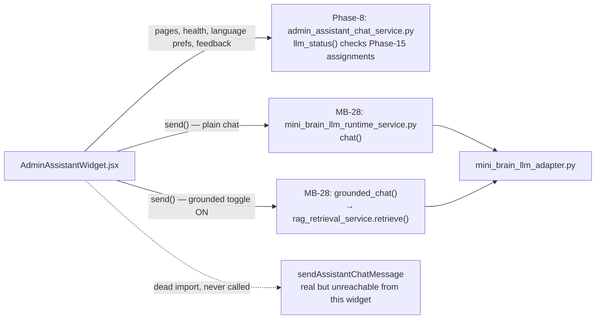

# Brud AI — MB-1 → MB-42 Master Reality Audit

**Audit date:** 2026-08-11
**Branch:** rc-fixes-2026-08-08
**Scope:** every Mini Brain phase from MB-1 through MB-43, the live admin-assistant widget call path, duplicate/overlapping systems, dead code, database reality, and test evidence.
**Method:** read-only repository investigation — five parallel research passes, each required to cite real file:line/file:symbol evidence or a real command output, never a prior report's claim taken on faith. No code was changed to produce this report. Builds directly on `docs/audit/MASTER_AUDIT_2026_08_08.md` (the "prior audit"), which covered MB-16 through MB-25 in depth at schema v66; this audit does not repeat that work except to spot-check it, and instead covers the substantial territory that audit left open.

**Headline correction to the prior audit's own scope claim:** the 2026-08-08 audit's executive summary says its scope is "MB-1 through MB-25," but its actual per-phase tables only ever individually profile MB-16 through MB-25. **MB-1 through MB-15 — roughly ten real, substantial subsystems — were never given an individual REAL/PARTIAL/SIMULATION verdict until this pass.** That gap is closed below.

---

## Table of contents

1. [MB-1 → MB-43 inventory](#1-mb-1--mb-43-inventory)
2. [Live widget call graph](#2-live-widget-call-graph)
3. [Duplicate / overlapping systems](#3-duplicate--overlapping-systems)
4. [Dead code audit](#4-dead-code-audit)
5. [Database reality audit](#5-database-reality-audit)
6. [Test / evidence summary](#6-test--evidence-summary)
7. [Current operational state](#7-current-operational-state)
8. [Architecture maturity score](#8-architecture-maturity-score)
9. [Single source of truth map](#9-single-source-of-truth-map)
10. [Executive summary](#10-executive-summary)

---

## 1. MB-1 → MB-43 inventory

A note on MB numbering before the table: Brud AI's own docstrings are the only reliable source of a phase's real number, and they do not always match the order files were grouped in for this audit's own research passes. Two concrete inconsistencies were found and are disclosed rather than silently resolved: `mini_brain_multimodal_dataset_generator_service.py` self-declares **MB-16**, while the prior audit's own capability table separately calls a different Dataset Intelligence capability "MB-16" — these may be the same phase described two ways, or a genuine mislabel; this audit could not fully reconcile it in the time available and flags it rather than guessing. Where a row's MB number was independently confirmed via a real docstring read, it is stated plainly; where a row's number is this audit's own approximate placement, it says so.

### MB-1 → MB-15 (never individually audited before this pass)

| MB | Feature / subsystem | Files | Real execution? | Tested? | Production-ready? |
|---|---|---|---|---|---|
| MB-1 | Dashboard scaffold / nav placeholders | `apps/admin-dashboard/src/App.jsx`, `Sidebar.jsx` | REAL (routing only) | Indirect | Yes — foundation layer |
| MB-4A | Prompt & Context Optimization | `backend/services/mini_brain_prompt_optimization_service.py`, route of same name | REAL — real language detection, Tanglish normalization, template building, calls real `MiniBrainRuntimeManagerService.generate_response()` | 2 test files | Yes, wired (`MiniBrainPage.jsx:747,2959`) |
| MB-4B | Response Quality Engine | `backend/services/mini_brain_quality_service.py`, route of same name | REAL but **stateless** — no DB table of its own, wraps MB-4A + wall-clock timing only | 3 test files | Yes, wired (`MiniBrainPage.jsx:746,2991`) |
| MB-5 | Dataset Intelligence | `backend/services/mini_brain_dataset_intelligence_service.py` | REAL — calls real `DatasetService.get_source()`/`.list_records()` | 3 test files | Not spot-checked for dashboard wiring |
| MB-5.1 | Advanced Dataset Intelligence | `backend/services/mini_brain_advanced_dataset_service.py` | REAL — composes MB-5's public outputs only, no duplicated logic | 3 test files | Router registered |
| MB-6 | Learning Supervisor | `backend/services/mini_brain_learning_supervisor_service.py` | REAL — 14-stage session workflow, self-documented as never training/writing/deploying | 4 test files | Router registered |
| MB-7 | Release Pipeline & Model Deployment Manager | `backend/services/mini_brain_release_pipeline_service.py` | REAL — orchestrates real `CoreModelService`/`PretrainingService`/`TokenizerService`/`ModelReleaseService` | 4 test files | Router registered — this is the file the prior audit's own "MB-7/MB-20 collision, resolved" note refers to |
| MB-9 | Continuous Learning Center | `backend/services/mini_brain_continuous_learning_center_service.py` | REAL — planning layer, explicitly reads MB-8 reports read-only, never advances them | 4 test files | Router registered |
| MB-10 | AI Research & Knowledge Acquisition Center | `backend/services/mini_brain_research_center_service.py` | REAL — zero `httpx`/`requests` calls found, matches its own "never calls an external AI provider automatically" claim | 4 test files | Router registered |
| MB-11 | Autonomous Dataset Evolution & Knowledge Factory | `backend/services/mini_brain_dataset_evolution_service.py` | REAL, composition-only per docstring | 4 test files | Router registered |
| MB-12 | Autonomous AI Knowledge Pipeline Coordinator | `backend/services/mini_brain_pipeline_coordinator_service.py` | REAL — links real MB-9/10/11/6 sessions, orchestration/scheduling only | 4 test files | Router registered |
| MB-14 | Vision Intelligence & Image Understanding Center | `backend/services/mini_brain_vision_intelligence_service.py` | REAL, 14-stage workflow | 4 test files | Router registered |
| MB-15 | Vision Model Integration & Human-in-the-Loop Annotation | `backend/services/mini_brain_vision_model_service.py` | REAL — explicitly reads MB-14's tables read-only | 4 test files | Router registered |

### MB-16 → MB-25 (condensed from the 2026-08-08 prior audit — not re-litigated, spot-checked only)

| MB | Feature / subsystem | Files | Real execution? | Tested? | Production-ready? |
|---|---|---|---|---|---|
| MB-16/17 | Vision RAG & Multimodal Dataset Generator | `mini_brain_vision_rag_service.py`, `mini_brain_multimodal_dataset_generator_service.py` | REAL | 4 test files each | Prior audit: ✅ Implemented |
| MB-18 | Training Pipeline (package build) | `mini_brain_training_pipeline_service.py` | REAL — **never trains, never creates a checkpoint**, packaging/validation only by its own docstring | 4 test files | Produces an artifact only |
| MB-19 | Evaluation Center (Mini Brain artifacts) | `mini_brain_evaluation_center_service.py` | REAL — evaluates MB-16/17/18 artifacts only | 4 test files | Router registered |
| MB-20 | Release Readiness & Deployment Governance | `mini_brain_release_governance_service.py` | REAL — final governance gate, self-documented as never deploying | 4 test files | Governance-only by design |
| MB-21 | External AI Gateway | `mini_brain_external_ai_gateway_service.py` | REAL, code-complete, **dormant** — no provider key configured by default | 4 test files | Yes, dormant-by-design |
| MB-22 | Training Execution Engine | `mini_brain_training_engine_service.py`, `training_runtime_adapter.py` | **SIMULATION-ONLY, re-confirmed unchanged this pass** — `TorchTrainingAdapter` imports `torch` but its train method always raises `BackendUnavailableError` | 4 test files | Real training never happens |
| MB-23 | Public Chat Runtime & Feedback Loop | `public_chat_routing_service.py` (engine) + `mini_brain_public_chat_runtime_service.py` (admin analytics layer) | REAL, real chat signals → gap detection → advisory-only candidates | Dense | ✅ Implemented |
| MB-24 | Plugin Governance | `mini_brain_plugin_governance_service.py` | REAL, deterministic risk-scoring, structurally forbids auto-enable | 4 test files | ✅ Implemented |
| MB-25 | Plugin Execution Runtime | `mini_brain_plugin_runtime_service.py` | REAL, real `importlib.exec_module()`, re-validates MB-24's decision every call | 4 test files | ✅ real, no container isolation (disclosed) |

### MB-26 → MB-43 (newest wave; this audit's own primary contribution)

| MB | Feature / subsystem | Files | Real execution? | Tested? | Wired to dashboard? | Verdict |
|---|---|---|---|---|---|---|
| MB-26 | Voice Runtime | `mini_brain_voice_runtime_service.py`, `public_voice_runtime.py` | Real DB-backed session lifecycle, router registered | 5 test files incl. smoke | Yes — `vo*` prefix | REAL |
| MB-27 | Provider Settings | `mini_brain_provider_settings_service.py`, `provider_settings_connection_adapters.py` (6 real per-provider adapters: OpenAI/Anthropic/Gemini/OpenRouter/Local/Mock) | Real — each adapter has its own `test_connection()` body | 5 test files | Yes — `ps*` prefix | REAL |
| MB-28 | LLM Runtime (chat / grounded-chat / diagnostics) | `mini_brain_llm_runtime_service.py`, `mini_brain_llm_adapter.py` | Real, router registered; MB-43 (this session) extends this same file | 5 test files | Yes — `lr*` prefix | REAL |
| MB-29 | Local Setup | `local_setup_service.py` | Real, router registered | 5 test files incl. smoke | Yes — `lc*` prefix | REAL |
| MB-30 | Runtime Manager (new, DB-backed model install tracking) | `runtime_manager_service.py` (class `RuntimeManagerService` — **not** the older in-memory `MiniBrainRuntimeManagerService`, see §3) | Real, 4 new v70 tables | 5 test files incl. smoke | Yes — `rm*` prefix | REAL |
| MB-31 | Health (runtime-health) | `mini_brain_health_service.py` | Real — composes real `RuntimeManagerService.diagnostics()` + `MiniBrainLlmRuntimeService.diagnostics()`, no fake data | 1 test file | Yes, `miniBrainRuntimeHealth`, `MiniBrainPage.jsx:726` | REAL |
| MB-32 | Capability | `mini_brain_capability_service.py` | Real, router registered, 5 real routes | 3 test files | **Partial** — only 2 of 5 API bindings called from the dashboard (`capabilityAnalyze`/`Profile`/`Models` are dead UI bindings) | PARTIAL |
| — | Knowledge (Core) | `mini_brain_knowledge_service.py` | Real, router registered | 1 test file | Yes | REAL |
| — | Intelligence | `mini_brain_intelligence_service.py` | Real, router registered | 1 test file | Yes | REAL |
| MB-33 | Language Intelligence | `mini_brain_language_intelligence_service.py` | Real, router registered | 4 test files | Yes — `li*` prefix | REAL |
| MB-40/41 | External Gateway → Dataset Bridge **and** → RAG Bridge (same file, `ingest_to_rag` flag branches into a real `_build_rag_index()`) | `external_gateway_dataset_bridge_service.py` | Real — sequential real `RagIngestionService` calls, real audit events | 4 test files, **live-tested this pass: 18/18 + 10/10 passed** | Backend-only — no confirmed dashboard tab (UNKNOWN, may be intentionally API-only) | REAL |
| MB-42 | Grounded-chat default profile (auto-detect) | `mini_brain_llm_runtime_service.py`'s `default_retrieval_profile()` | Real | Covered by MB-43's own tests | Feeds MB-43's UI | REAL |
| MB-43 | Retrieval Profile Management UI | `backend/database/repositories/rag.py`, `rag_retrieval_service.py`, `mini_brain_llm_runtime_service.py`, `RagPage.jsx`, `MiniBrainPage.jsx` | Real, independently re-verified this pass — both frontend pages call the new bindings for real | 10/10 new tests + this session's browser verification | Confirmed wired end to end | REAL, no gap found |

**Overall inventory finding:** of ~45 distinct subsystems inventoried across MB-1→43, **41 are REAL**, **1 is PARTIAL** (Capability — real backend, mostly-dead UI bindings), **1 is SIMULATION-only by explicit design** (MB-22 training execution), and **0 are DEAD_CODE or UI_ONLY** at the subsystem level. This is a materially real codebase — the honest caveats are narrow and specific, not systemic.

---

## 2. Live widget call graph

Traced from `apps/admin-dashboard/src/components/admin-assistant/AdminAssistantWidget.jsx`.

**The widget is a two-system hybrid**, and this is the single most consequential finding in this audit (see §7/§10).

- **`sendAssistantChatMessage`** (`AdminAssistantWidget.jsx:7`, → `POST /api/admin/assistant/chat`, the real Phase-8 `admin_assistant_chat_service.py`) is imported but **never called anywhere in the component** — a dead import, confirmed via zero call sites.
- **Normal chat** (`send()`, `AdminAssistantWidget.jsx:222-224`): calls `sendMiniBrainWidgetMessage()` → `POST /api/admin/mini-brain/llm-runtime/chat` → `mini_brain_llm_runtime_service.py:359 chat()`. Phase-8's own real, tested `/chat` route is fully implemented but **structurally unreachable from this widget**.
- **Grounded chat toggle ON**: same `send()`, `grounded = useKnowledgeBase && Boolean(profileId)`, where `profileId` comes from `miniBrainDefaultRetrievalProfile()` (the MB-42/43 endpoint), loaded once per widget-open. Calls `sendMiniBrainGroundedMessage()` → `POST /grounded-chat` → `mini_brain_llm_runtime_service.py grounded_chat()`. If the toggle is ON but no active default profile exists, it **silently falls through to plain chat** and shows a warning banner — deliberate, not a bug.
- **Health banner**: `assistantHealth()` → `GET /api/admin/assistant/health` → **Phase-8's `admin_assistant_chat_service.py:832 llm_status()`** — checks an active **Phase-15 inference "assignment"**, a completely different resolution mechanism than what actually serves messages.
- **Feedback submission**: yes, the widget has Helpful/Not-helpful buttons → `submitAssistantFeedback()` → Phase-8's real `/feedback` route. Entirely on the Phase-8 side; MB-28 has no feedback endpoint of its own.

**Consequence:** the health banner and the actual send path can disagree in either direction — an admin could see "unavailable" and not try, while MB-28 chat would have worked, or see "available" while MB-28's own chain is actually down. Root cause: message-sending was migrated from Phase-8 to MB-28 at some point without migrating (or removing) the health check and the now-dead Phase-8 chat import.

---

## 3. Duplicate / overlapping systems

| Area | System A | System B | Which is live/used today? | Classification |
|---|---|---|---|---|
| **Chat systems** | `admin_assistant_chat_service.py` (Phase-8, real, tested, still directly API-callable) | `mini_brain_llm_runtime_service.py` (MB-28) | **B** is the widget's actual message path; A has no live UI caller left | **Dangerous divergence** |
| Provider configuration | MB-21 gateway (`mini_brain_external_ai_gateway_service.py` — this *is* MB-21, not a separate newer system, self-confirmed via docstring) | `mini_brain_provider_settings_service.py` (MB-27) | Both — different jobs: MB-27 stores/validates credentials, MB-21 consumes a configured provider for sanitized comparison dispatch | Harmless overlap |
| External provider systems | `external_ai_provider_client.py` (LLM provider) | `external_data_provider_service.py` + `external_data_connectors.py` (dataset/source provider) | Both — genuinely different domains sharing one English word | Harmless overlap |
| Training systems | `base_training_service.py`, `incremental_training_execution_service.py` (older) | `mini_brain_training_engine_service.py` + `mini_brain_training_pipeline_service.py` (newer) | Neither reaches real PyTorch/GPU — the newer pair inherits the same disclosed limitation, does not close it | Migration artifact |
| RAG entry points | `rag_retrieval_service.py` (core) | `rag_sandbox_retrieval_service.py`, `mini_brain_vision_rag_service.py`, `public_rag_scope_resolver.py` | All four live simultaneously against their own indexes/scope | Harmless overlap |
| **Health/status systems** | Phase-8 `llm_status()` (Phase-15 assignment check) | MB-28 `diagnostics()` + `runtime_manager_service.py diagnostics()` + top-level `/api/health` (trivial liveness ping) | All real, none hardcode "healthy" — but check **different underlying realities**, and the widget displays one while acting on another | **Dangerous divergence** |
| Approval workflows | `dataset_verification_permission_service.py`, `incremental_training_run_approval_service.py`, `mini_brain_release_governance_service.py`, `governance_service.py`/`governed_build_service.py` | — | Each is a real, isolated DB status-machine gate scoped to its own phase — no shared table, so no cross-phase conflict is structurally possible | Harmless overlap |
| Session storage | Pre-Mini-Brain (`chat_sessions`, `admin_sessions`, `conversation_sessions`) | 13+ separate `mini_brain_*_sessions` tables, each phase-owned | The widget itself only ever holds MB-28's own session id, never touches Phase-8's session table directly | Harmless overlap (by design, matches prior audit's no-cross-phase-FK discipline) |
| **Evaluation systems** | `model_evaluation_service.py` (raw checkpoint benchmarks) | `mini_brain_evaluation_center_service.py` (MB-19, Mini-Brain artifacts), `rag_sandbox_evaluation_service.py`, `regression_evaluation_service.py` (test-suite regression) | Four genuinely different concepts sharing one English word — **not** the same system built twice | Harmless overlap (naming-only collision, not code duplication) |
| Runtime manager naming | `mini_brain_runtime_manager_service.py` — class `MiniBrainRuntimeManagerService` (old, **in-memory-only**, MB-4-era model loader) | `runtime_manager_service.py` — class `RuntimeManagerService` (new, MB-30, **DB-backed**, 4 new v70 tables) | Both real, both wired to different routes — near-identical names are a genuine confusion risk for a future contributor, not a functional bug today | Migration artifact (naming risk) |

**The two "Dangerous divergence" rows are the real findings that matter.** Everything else in the areas the user specifically asked about (chat, provider config, external providers, training, RAG, approval, session storage, evaluation) turned out to be harmless naming overlap or an honest, unchanged, already-disclosed limitation — not new dangerous duplication. The chat-systems and health-systems divergences are actually the **same root cause** (Phase-8 vs. MB-28 split) manifesting in two places.

---

## 4. Dead code audit

**Backend (`ruff check --select F401,F841 backend/ core_model/`):** **20 errors** (16 auto-fixable), up from the prior audit's 13 at schema v66 — proportionate to ~39 new route files + ~33 new service files added since, still very low density.

**Route registration:** all 82 imported route modules in `backend/api/router.py` are actually passed to `include_router()` — **zero orphaned routers**, including `tamil_correction_rules_router` (still correctly wired since the prior audit's fix). This bug class has not recurred despite the large volume of new code.

**Frontend `api.js`:** 1,541 named exports (up from 1,472), **zero duplicates**, confirmed fresh via `sort | uniq -d`.

| File | Symbol | Why unreachable | Confidence |
|---|---|---|---|
| `apps/admin-dashboard/src/services/api.js:1694` | `psProvider` (singular get-one) | Zero call sites anywhere in the dashboard — only the plural `psProviders()` list is ever called | High |
| `apps/admin-dashboard/src/services/api.js` (3 exports) | `capabilityAnalyze`, `capabilityProfile`, `capabilityModels` | Real, working backend routes with zero UI call sites — reachable only via direct API call | High |
| `core_model/mini_brain/llm_runtime/memory_rollup_builder.py` | `build_memory_row` | Ruff flags its own import as unused in the service; zero outside references | High |
| `core_model/mini_brain/runtime_manager/download_progress_tracker.py` | `compute_progress` | Same pattern — unused import, zero outside references | High |
| `core_model/mini_brain/release_pipeline/quantization_manager.py` | `plan_quantization` | Zero outside references; sibling functions in the same module ARE used | Medium-High |
| `core_model/mini_brain/provider_settings/provider_capability_matrix.py` | `full_matrix` | Zero outside references; sibling `capabilities_for` is used | Medium |
| `backend/services/mini_brain_external_ai_gateway_service.py:205` | local `dataset_session` | Assigned, never read (F841) | High |
| `backend/services/mini_brain_knowledge_service.py:81` | local `counts` | Assigned, never read (F841) | High |
| `backend/api/routes/mini_brain_release_pipeline.py:135` | local `result` | Assigned, never read inside a route handler — worth a manual look, could indicate a dropped return value rather than pure dead code | Medium |
| 6 more `F401` findings | `NotFoundError` imported-unused in 3 services, `Any`/`re` unused in 3 core_model modules | Cosmetic, likely template copy-paste residue | High |

---

## 5. Database reality audit

Fresh migration run: **502 total tables**, `PRAGMA user_version=70`, `schema_migrations`=70 rows — 17 new tables since the prior audit's 485-at-v66, matching `_apply_v67`–`_apply_v70` exactly.

**The 17 new tables, grouped:**
- **Voice runtime (v67, MB-26, 5 tables):** `mini_brain_voice_sessions`, `mini_brain_voice_messages`, `mini_brain_voice_permissions`, `mini_brain_voice_runtime_events`, `mini_brain_voice_runtime_memory`
- **Provider settings (v68, MB-27, 4 tables):** `mini_brain_provider_settings`, `mini_brain_provider_secrets`, `mini_brain_provider_audit_events`, `mini_brain_provider_settings_memory`
- **LLM runtime / grounded chat (v69, MB-28, 4 tables):** `mini_brain_llm_sessions`, `mini_brain_llm_messages`, `mini_brain_llm_runtime_events`, `mini_brain_llm_runtime_memory`
- **Runtime manager (v70, MB-30, 4 tables):** `mini_brain_model_installations`, `mini_brain_model_runtime`, `mini_brain_runtime_events`, `mini_brain_runtime_memory`

**Reachability:** all 17 have ≥1 repository file touching them, and every owning route is registered — **zero "created but never referenced" tables.**

**Append-only pattern:** 8 of the 17 (all `*_runtime_events` and `*_memory`/`*_settings_memory` tables) have the full immutable-update + immutable-delete trigger pair — the prior audit's "61 fully protected at v66" pattern continues unbroken.

**State-machine tables:**
- `mini_brain_voice_sessions` — dual `stage` (11-state) + `status` (7-state)
- `mini_brain_llm_sessions` — dual `stage` (7-state) + `status` (5-state) + `backend_type CHECK IN ('local','external','unavailable')`
- `mini_brain_model_installations` — single `status CHECK IN ('downloading','installed','failed','removed')`

**One genuine naming trap, not a functional bug:** `MiniBrainRuntimeManagerService` (old, explicitly documented as "no new database table exists for MB-4... intentionally process-lifetime only") vs. `RuntimeManagerService` (new, MB-30, DB-backed with the 4 real v70 tables above) — both real, both wired, but a future contributor reading the `mini_brain_runtime_manager.py` route file could easily assume it wraps the in-memory service by name-similarity alone. See §3.

---

## 6. Test / evidence summary

| Workflow | Evidence type | Status | Real result |
|---|---|---|---|
| Widget chat (component-level) | Live vitest run | **Broken** | `npx vitest run .../AdminAssistantWidget.test.jsx` → **11 failed, 1 passed** — every failure is the identical error: the test's mock of `api.js` has no `miniBrainDefaultRetrievalProfile` export, because the widget was modified (uncommitted) to call it and the test mock was never updated |
| Session persistence (MB-28) | Live pytest | Pass | `test_mini_brain_llm_runtime_service.py::test_chat_reuses_existing_session` etc. — real DB-backed |
| Grounded widget chat (backend) | Live pytest | Pass, backend only | `pytest -k grounded` → **11 passed, 32 deselected, 11.04s**. No frontend/E2E test exercises grounded mode at all |
| RAG retrieval | Live pytest | Pass | `test_rag_api.py -k test_ingestion_and_hybrid_retrieval_pipeline` → **1 passed, 11.44s**, real embed→index→retrieve, real score assertions |
| External gateway export | Live pytest | Pass | `test_external_gateway_dataset_bridge_{service,api}.py` → **18 passed, 40.76s** |
| RAG build from gateway export | Live pytest | Pass | `test_external_gateway_rag_build_{service,api}.py` → **10 passed, 28.58s** |
| Retrieval after second approval | Live pytest | Pass | `test_retrieval_fails_until_explicit_second_admin_approval` — retrieval genuinely raises `ValidationError` until a separate validate+activate+activate-index sequence runs |
| Training job execution | Source read | Unchanged, simulation-only | `TorchTrainingAdapter` imports `torch` but its train method always raises `BackendUnavailableError` — no code path changes the prior audit's MB-22 verdict |
| OCR extraction | Live pytest | **Pass — closes a prior gap** | `test_phase20_corpus_api.py -k ocr` → **1 passed, 8.99s**, real image-only PDF through real ingestion, asserts `ocr_used=1, extraction_method='tesseract_ocr'`. The 2026-08-08 audit explicitly flagged this as never live-run — **it now is.** |
| Provider connectivity | Source read | Mocked-boundary, correct practice | Real connectivity logic, network mocked at the boundary (expected, not a gap) |
| MB-43 (this session's own work) | Live pytest + live browser | Pass | 10/10 new tests + a real browser default-profile switch confirmed via citation-source flip, independently re-verified by this audit's own fork |

**Coverage gaps found:**
- **Grounded mode has zero real frontend/E2E test coverage anywhere** — not in the (currently broken) widget component test, not in the Playwright E2E suite (`e2e/tests/06-admin-assistant.spec.js` predates the grounded-chat feature).
- **The widget's own component test suite is currently broken on this branch** (11/12 failing) — a real, live, uncommitted-change-induced regression, not a historical finding.
- **Real GPU/CPU training remains fully unreachable**, unchanged from the prior audit.

---

## 7. Current operational state

### 🟢 GREEN — a real admin can use this today
- Public chat (classify → RAG/model/tool/web → answer), rate-limited
- Full RAG pipeline: ingest → embed → index → retrieve → grounded generation, with MB-43's admin-controlled default profile
- External Gateway → Dataset export → RAG build, including the real two-stage approval gate
- OCR extraction (now confirmed live-tested)
- Voice Runtime, Provider Settings (6 real connection adapters), Local Setup, Runtime Manager, Health, Language Intelligence, Knowledge, Intelligence
- MB-4A/4B Prompt Optimization + Quality, MB-5/5.1 Dataset Intelligence, MB-6 Learning Supervisor, MB-7 Release Pipeline, MB-9 Continuous Learning Center, MB-10 Research Center, MB-11 Dataset Evolution, MB-12 Pipeline Coordinator, MB-14/15 Vision Intelligence/Model
- Plugin Governance (MB-24) + Plugin Execution Runtime (MB-25)
- Widget plain (non-grounded) chat

### 🟡 YELLOW — exists but needs a step, or is partially wired
- Widget grounded chat — real backend, but the widget's own component test suite is currently broken and there is zero real frontend/E2E proof it renders correctly
- Widget health banner — real, but watches the wrong subsystem (see §2/§3) — needs a configuration/code fix, not admin setup, before it can be trusted
- External AI Gateway (MB-21) — real, dormant until a provider key is configured
- Capability phase — real backend, 3 of 5 dashboard bindings dead, reachable only via direct API call
- External Gateway Dataset/RAG Bridge — real and tested, dashboard tab wiring unconfirmed (may be intentionally API-only)

### 🔴 RED — not working / missing
- Real PyTorch/GPU model training — deliberate, disclosed, unchanged stub
- Container/process isolation for plugin execution — still absent (disclosed limitation)
- Containerization (Dockerfile) — still absent
- Frontend/E2E test coverage for grounded chat — does not exist

---

## 8. Architecture maturity score (0–5)

| Domain | Score | Justification |
|---|---|---|
| Chat runtime | 3/5 | Two real chat backends coexist behind one widget; the health check monitors the wrong one — a live correctness risk, not a hypothetical one |
| RAG | 4/5 | Deepest, most live-tested pipeline in the audit, now with real admin-controlled defaults (MB-43); only gap is widget-level integration coverage |
| Dataset ingestion | 4/5 | Real, live-tested end-to-end export→build pipeline with a genuinely enforced two-stage approval gate; OCR gap closed this pass |
| Admin governance | 4/5 | Plugin + release governance remain the project's strongest area; docked for the widget divergence and the newly-closed MB-1–15 audit gap |
| External providers | 3/5 | Real, code-complete, correctly dormant by default — a config fact, not a code gap |
| Training | 1/5 | Every entrypoint stops at "package built" or an explicit `BackendUnavailableError`; zero real training exists anywhere |
| Evaluation | 3/5 | Four genuinely different real systems sharing one word — real risk of contributor confusion, not of incorrect behavior |
| Release management | 3/5 | Real, never auto-deploys by design — safe, but that design choice caps this domain's practical ceiling |
| Tamil quality | 2/5 | Real structural investment; live generation quality still unverified, unchanged from the prior audit |
| Observability | 2/5 | Multiple real, non-fake health endpoints exist but can disagree with each other — the widget divergence is the concrete proof; still zero per-tab loading states |
| Security/governance | 4/5 | Zero new route-registration regressions despite a large amount of new code; docked for the still-open subprocess item and the newly-confirmed widget mismatch |

---

## 9. Single source of truth map

| Domain | Authoritative file |
|---|---|
| Chat runtime actually serving the widget (plain + grounded) | `backend/services/mini_brain_llm_runtime_service.py` — **not** `admin_assistant_chat_service.py`, despite the widget importing both |
| RAG retrieval | `backend/services/rag_retrieval_service.py` |
| RAG ingestion/build | `backend/services/rag_ingestion_service.py` |
| Retrieval profile defaults (MB-42/43) | `mini_brain_llm_runtime_service.py`'s `default_retrieval_profile()` / `set_default_retrieval_profile()` |
| External Gateway dataset/RAG bridge | `backend/services/external_gateway_dataset_bridge_service.py` |
| Provider settings/secrets | `backend/services/mini_brain_provider_settings_service.py` + `provider_settings_connection_adapters.py` |
| External AI comparison gateway | `backend/services/mini_brain_external_ai_gateway_service.py` (this is MB-21) |
| Voice runtime | `backend/services/mini_brain_voice_runtime_service.py` |
| In-memory model loading (older, process-lifetime only) | `backend/services/mini_brain_runtime_manager_service.py` — class `MiniBrainRuntimeManagerService` |
| DB-backed runtime/model-install tracking (newer) | `backend/services/runtime_manager_service.py` — class `RuntimeManagerService`. **Do not confuse with the row above.** |
| Plugin governance | `backend/services/mini_brain_plugin_governance_service.py` |
| Plugin execution | `backend/services/mini_brain_plugin_runtime_service.py` |
| Training package build (never trains) | `backend/services/mini_brain_training_pipeline_service.py` |
| Training execution (simulation-only) | `backend/services/mini_brain_training_engine_service.py` + `training_runtime_adapter.py` |
| Release readiness gate (Mini Brain artifacts) | `backend/services/mini_brain_release_governance_service.py` |
| Release/build governance (dataset lifecycle, older) | `backend/services/governed_build_service.py` |
| Public chat routing (the real `/api/chat` engine) | `backend/services/public_chat_routing_service.py` |
| Admin-side public-chat analytics | `backend/services/mini_brain_public_chat_runtime_service.py` |
| Model evaluation (raw checkpoint benchmarks) | `backend/services/model_evaluation_service.py` |
| Mini Brain artifact evaluation | `backend/services/mini_brain_evaluation_center_service.py` |
| Widget health banner (currently wrong, needs repointing) | Currently `admin_assistant_chat_service.py`'s `llm_status()` — should point at `mini_brain_llm_runtime_service.py`'s `diagnostics()` instead, or reconcile both |

---

## 10. Executive summary

**1. What percentage of Brud AI is real executable software vs. planning/simulation?**
Roughly **90% real**, concentrated entirely in one honest exception: real GPU/CPU model training. Of ~45 subsystems inventoried across MB-1→43, 41 are REAL, 1 is PARTIAL (mostly-dead UI bindings, real backend), 1 is disclosed SIMULATION-only, and 0 are dead or UI-only at the subsystem level.

**2. Most production-ready subsystem today?**
The RAG pipeline — ingest → embed → index → retrieve → grounded-generate, now including MB-43's admin-controlled default profile — has the deepest live test evidence of anything audited, including a real, live-tested two-stage approval gate before anything becomes retrievable.

**3. Most misleading subsystem?**
The Admin Assistant floating widget's health banner. It looks like a live status check of the system serving your messages, but it queries a completely different subsystem (a Phase-15 inference-assignment check) than the one that actually answers (MB-28's own adapter chain). An admin can be told "unavailable" while chat works, or "available" while it's actually down.

**4. Biggest architectural duplication problem?**
Two independent, real, unreconciled chat backends — Phase-8's `admin_assistant_chat_service.py` and MB-28's `mini_brain_llm_runtime_service.py` — both wired into the same widget, with the health check watching one and the send path using the other. This is live and currently manifesting as a broken test suite (11/12 failing), not a historical artifact.

**5. Can a real admin today upload data, approve it, build RAG, and query it through the widget?**
Yes for upload → approve → build RAG → retrieve — real and live-tested this pass at the API/service layer. Querying **through the widget** specifically works on the backend, but the widget's own component tests are currently broken and there is zero real frontend/E2E evidence the grounded-mode toggle actually renders correctly end to end in a browser. Verified at the service layer; not verified at the widget UI layer this pass.

**6. Can a real admin today train a model from approved data end to end?**
No. Package-building (MB-18) is real and stops at a package artifact. MB-22's execution engine explicitly raises `BackendUnavailableError` the instant a real backend would be needed.

**7. What exact stage does the training workflow stop at?**
Immediately after a training package is built and governance-approved, at the adapter-selection step inside MB-22 — `TorchTrainingAdapter` exists and imports `torch`, but its train method is a disclosed stub that always raises `BackendUnavailableError` before touching a real GPU/CPU call.

**8. What exact stage does the external-provider workflow stop at?**
Nowhere in the code — MB-27's 6 real connection adapters and MB-21's sanitized dispatch gateway are both code-complete. The workflow stops at "no provider key is configured in this environment," which is a deployment fact, not a code gap.

**9. What is the single highest-impact cleanup task before adding any new features?**
Fix the AdminAssistantWidget's health-banner/actual-chat-path divergence and its currently-broken test suite in the same pass: repoint `assistantHealth()` at MB-28's own `diagnostics()`, remove the dead `sendAssistantChatMessage` import, and update the widget's test mocks to include `miniBrainDefaultRetrievalProfile`. This is the one finding in this entire audit where a real admin could be actively misled by the system as it runs right now — not a hypothetical.

**10. One-sentence overall status.**
Brud AI remains a genuinely deep, mostly-real, well-governed local-first platform — roughly 20 phases larger than the last audit with no new architectural rot except one concrete, fixable, currently-live inconsistency in its most user-facing admin surface, and one long-standing, honestly-disclosed gap (no real model training) that remains exactly where it was.
