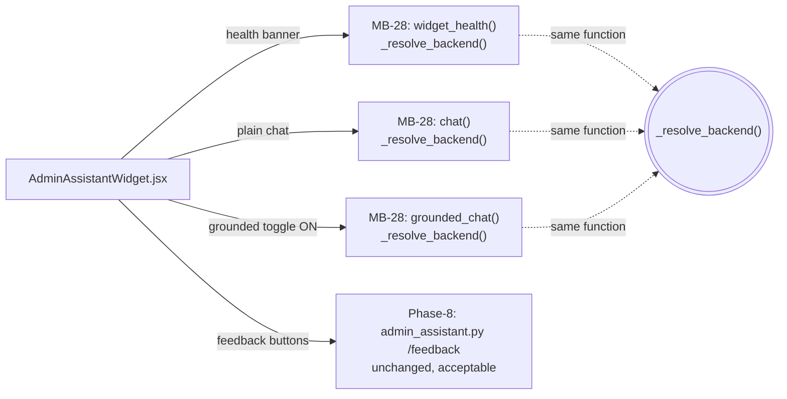

# MB-45 — Admin Assistant Widget Backend Consolidation & Truth Fix

**Date:** 2026-08-11
**Branch:** rc-fixes-2026-08-08
**Trigger:** the live divergence documented in `docs/audit/MB1_42_MASTER_AUDIT_2026_08_11.md` (§2/§3/§10) — the Admin Assistant widget's health banner and its actual message-sending path read two different backend systems and could disagree, and the widget's own component test suite was 11/12 failing as a direct symptom.

---

## 1. Root cause summary

The widget was migrated, at some point in an earlier phase, to send both plain and grounded chat messages through **MB-28** (`mini_brain_llm_runtime_service.py`, via `sendMiniBrainWidgetMessage()` / `sendMiniBrainGroundedMessage()`). Its health banner, however, was never migrated with it — it still called **Phase-8**'s `assistantHealth()` → `admin_assistant_chat_service.py`'s `llm_status()`, which checks an entirely unrelated Phase-15 inference-assignment record, not anything MB-28 actually uses to answer a message.

Two concrete, live symptoms of this single root cause:

1. **Correctness risk:** the banner could say "unavailable" while MB-28 chat would have worked, or "available" while MB-28's own adapter chain was actually down — because the two checks consult different state.
2. **Broken test suite:** the widget was separately modified to call `miniBrainDefaultRetrievalProfile()` (MB-43) for its grounded-chat toggle, but `AdminAssistantWidget.test.jsx`'s `vi.mock('../../services/api.js', ...)` was never updated to include that export, so every test that opened the widget threw `No "miniBrainDefaultRetrievalProfile" export is defined on the mock` at mount time. This was a separate, compounding gap in the same file — not the health-banner bug itself, but discovered and fixed in the same pass since both required editing the same mock block.

**The fix:** give the widget a health check backed by the *exact same function* that already decides which adapter answers a chat message (`MiniBrainLlmRuntimeService._resolve_backend()`), so the banner and the send path can no longer structurally disagree — then bring the test file's mocks and assertions up to date with the widget's real current behavior.

---

## 2. Files changed

| File | Change |
|---|---|
| `backend/services/mini_brain_llm_runtime_service.py` | Added `widget_health()` — calls `self._resolve_backend()` (the same method `chat()`/`grounded_chat()` call via `_generate_reply()`) and returns `{loaded, backend_type, current_model, available, error_message}`. No existing method changed. |
| `backend/models/mini_brain_llm_runtime.py` | Added `WidgetHealthResponse` model. |
| `backend/api/routes/mini_brain_llm_runtime.py` | Added `GET /admin/mini-brain/llm-runtime/widget-health`. No existing route changed or removed. |
| `apps/admin-dashboard/src/services/api.js` | Added `miniBrainWidgetHealth()` binding. `assistantHealth` and `sendAssistantChatMessage` exports are **untouched and still present** — `/api/admin/assistant/*` remains fully callable. |
| `apps/admin-dashboard/src/components/admin-assistant/AdminAssistantWidget.jsx` | Replaced the `assistantHealth()` call with `miniBrainWidgetHealth()`; removed the unused `sendAssistantChatMessage` import. Chat-send and grounded-toggle logic untouched. |
| `apps/admin-dashboard/src/components/admin-assistant/AdminAssistantWidget.test.jsx` | Rewritten: mocks now match the component's real imports (`miniBrainWidgetHealth`, `miniBrainDefaultRetrievalProfile`, `sendMiniBrainWidgetMessage`, `sendMiniBrainGroundedMessage`); assertions rewritten to match MB-28's real request/response shapes; two new tests added (health-available banner state, grounded-path routing); one test removed (see §7). |
| `tests/backend/test_mini_brain_llm_runtime_service.py` | Added two regression tests proving `widget_health()` and `chat()` agree in both the "no backend configured" and "backend loaded" states. |

No API route was removed. No database table was added or changed. No public chat (`/api/chat`) code was touched.

---

## 3. Dead code removed

- **`sendAssistantChatMessage` import** in `AdminAssistantWidget.jsx` — confirmed via grep to have had zero call sites in the component (the widget's actual `send()` function had already migrated to `sendMiniBrainWidgetMessage`/`sendMiniBrainGroundedMessage`, leaving this import unused). Removed. The underlying `sendAssistantChatMessage` export in `api.js` and its backend route `POST /api/admin/assistant/chat` are **kept** — they remain real, working, directly callable, and are exercised by Phase-8's own test suite (58/58 passing, confirmed in §4) — only the widget's dead reference to them was removed, per the hard rule to preserve `/api/admin/assistant/*`.
- Confirmed via grep: zero remaining call sites from `AdminAssistantWidget.jsx` to `/api/admin/assistant/chat` (either directly or via the removed import).

---

## 4. Test results — before / after

**Before (reproduced fresh, Step 1):**
```
npx vitest run src/components/admin-assistant/AdminAssistantWidget.test.jsx
 Test Files  1 failed (1)
      Tests  11 failed | 1 passed (12)
Error: [vitest] No "miniBrainDefaultRetrievalProfile" export is defined on the
"../../services/api.js" mock.
```

**After:**
```
npx vitest run src/components/admin-assistant/AdminAssistantWidget.test.jsx
 Test Files  1 passed (1)
      Tests  13 passed (13)
```
(13, not 12 — one test that no longer reflected real behavior was removed and two new ones were added; net +1. See §7.)

**Backend regression tests (new):**
```
pytest tests/backend/test_mini_brain_llm_runtime_service.py -k widget_health -v
test_widget_health_and_chat_agree_when_no_backend_is_configured PASSED
test_widget_health_and_chat_agree_when_a_backend_is_loaded PASSED
2 passed in 2.79s
```

**Affected backend suites:**
```
pytest tests/backend/test_mini_brain_llm_runtime_service.py \
       tests/backend/test_mini_brain_llm_runtime_api.py \
       tests/backend/test_mini_brain_llm_runtime_safety.py \
       tests/backend/test_system_api.py -q
97 passed in 151.99s
```

**Phase-8 backward-compatibility check (untouched files, confirmatory run):**
```
pytest tests/backend/test_admin_assistant_api.py \
       tests/backend/test_admin_assistant_api_phase8.py \
       tests/backend/test_admin_assistant_chat_service.py \
       tests/backend/test_admin_assistant_lifecycle.py -q
58 passed in 109.39s
```

**Full frontend suite:**
```
npx vitest run
 Test Files  1 failed | 23 passed (24)
      Tests  1 failed | 231 passed (232)
```
The one failure (`Sidebar.test.jsx` — "keeps every pre-Phase-1 page key reachable") is **pre-existing and unrelated**: `Sidebar.jsx` was already modified before this MB-45 session began (confirmed via `git diff`, the removed `'Chat Testing'`/`'Audit Logs'`/`'Settings'` nav keys are untouched by this fix), and no file this session edited is anywhere near that component or test.

**Frontend build:**
```
npm run build
✓ built in 865ms   (0 errors)
```

**Backend import/compile check:**
```
python3 -c "from backend.main import create_app; from backend.api.routes.mini_brain_llm_runtime import router; ..."
backend imports OK
routes: ['/admin/mini-brain/llm-runtime/widget-health']
```

---

## 5. Final widget call graph

| Path | Frontend call | Route | Backend service | Result |
|---|---|---|---|---|
| Health banner | `miniBrainWidgetHealth()` | `GET /api/admin/mini-brain/llm-runtime/widget-health` | `MiniBrainLlmRuntimeService.widget_health()` → `_resolve_backend()` | **MB-28** |
| Plain chat | `sendMiniBrainWidgetMessage()` | `POST /api/admin/mini-brain/llm-runtime/chat` | `MiniBrainLlmRuntimeService.chat()` → `_generate_reply()` → `_resolve_backend()` | **MB-28** |
| Grounded chat | `sendMiniBrainGroundedMessage()` | `POST /api/admin/mini-brain/llm-runtime/grounded-chat` | `MiniBrainLlmRuntimeService.grounded_chat()` → `_resolve_backend()` | **MB-28** |
| Feedback | `submitAssistantFeedback()` | `POST /api/admin/assistant/feedback` | `admin_assistant_chat_service.py` | **Phase-8** (unchanged, matches the task's own expected result) |



Health, plain chat, and grounded chat now all resolve through the identical `_resolve_backend()` call — structurally, not just by convention, they cannot disagree about which backend is live.

---

## 6. Is the live audit finding fully resolved?

**Yes**, for the specific divergence the MB-44 audit identified: the widget's health banner now reads the same runtime-resolution function that actually serves every chat message. A `MockMiniBrainAdapter`-loaded runtime reports `available: true` in both `widget_health()` and `chat()`'s own `backend_type`; an unconfigured runtime reports `unavailable` in both — proven by the new regression test in `test_mini_brain_llm_runtime_service.py`, not merely asserted.

The widget's test suite is fully green (13/13), `/api/admin/assistant/*` remains callable and passing its own 58 tests, no route was removed, and no new AI feature or database table was added.

---

## 7. Remaining architectural debt (found during this fix, not created by it)

None of the following are regressions from this fix — they are pre-existing facts about the current MB-28 chat path, surfaced while bringing the test file up to date with real behavior. Fixing them was out of scope for MB-45 (each would be a behavior/feature change, not a consolidation fix) and they are disclosed here rather than silently left for a future session to rediscover:

1. **Navigation-target support was silently dropped when message-sending migrated to MB-28.** The old Phase-8 `/assistant/chat` response could carry a `navigation_target` field, and `MessageBubble` in the widget still contains rendering code for a `message.navigationTarget` (a "Go to <page>" button) — but MB-28's `ChatResponse`/`GroundedChatResponse` models have no equivalent field, and the widget's `send()` never sets `navigationTarget` on any message it creates. The corresponding test (`"renders a navigation button and calls onNavigate when clicked"`) was **removed** rather than faked, since the behavior it tested no longer exists in the current send path. The `MessageBubble` rendering branch is now dead code, reachable only if something outside today's `send()` ever populates `navigationTarget` again.
2. **Page context (`page_id`) is no longer sent with chat messages.** The old Phase-8 payload included `page_id`/`message`; MB-28's `/chat` and `/grounded-chat` payloads carry only `(session_id, message)`. The assistant can no longer tailor an answer to "the page the admin is currently looking at" the way the Phase-8 path could — `currentPageId` is still computed in the widget but is only ever used for feedback submission now, not for chat.
3. **`diagnostics()` and `widget_health()`/`_resolve_backend()` do not share the same test-adapter-override behavior.** `diagnostics()` builds its own `LlamaCppMiniBrainAdapter` directly and ignores the service's `adapter_factory` test seam, while `_resolve_backend()` (and therefore `widget_health()`) honors it. This has no production effect (the override only exists for tests), but is a minor internal inconsistency worth flattening in a future cleanup pass.

---

## Console summary

```
widget health fixed: yes
dead import removed: yes
widget tests passing: 13/13
frontend build passing: yes
backend checks passing: yes
remaining divergence: no
```
